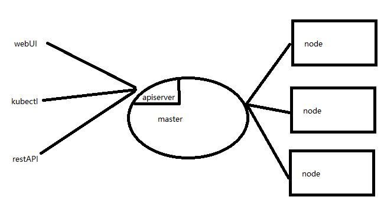
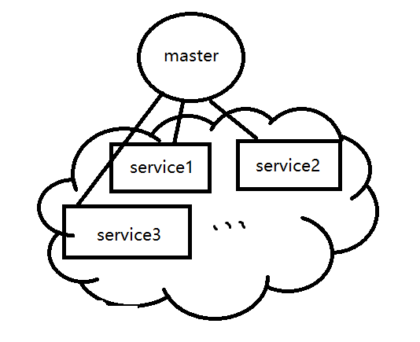

# 初识kubernetes
kubernetes是管理docker容器的工具，他可以解决这样的一些问题，动态的扩展docker，同一服务类型多个docker的负载均衡，分布式的容器管理，实时保持设定好的服务数目。
## 1 分布式容器调度工具
k8s的运行模式简单讲就是master+node的形式，一个master来管理下属的各个node节点上的容器。master提供了三种用户参与管理的方式，一个是图形化web页面管理，一个是kubectl命令行管理，还有一个就是8080端口的restAPI管理。  
  
## 2 master如何调度node
上面讲三种方式给master下发命令，令其调度node。这两者之间又是怎么协调工作的呢？

master上有四个进程：`etcd`, `kube-apiserver`,  `kube-controller-manager`, `kube-scheduler`。  
其中etcd是一个数据库用来存储一些kube集群的元数据。apiserver就是监听8080端口，接收用户的指令，同时也通过这个server调度node节点。controller-manager各种资源的自动化控制中心。scheduler则是调度pod的进程。

node上有三个进程：`kubelet`, `kube-proxy`, `docker`。
其中kubelet是用来和master的apiserver保持通信，接收调度任务并执行调度任务的。而kube-proxy是为了能在service虚拟ip之间互相通信设置和service下多个pod负载均衡实现组件（后面会说service和pod的概念）。docker则是容器实现。

用户下发配置或指令给master（apiserver），master（apiserver）将改信息发给node（kubelet）进行相关的操作。此件数据会存储到etcd，如果有pod的创建删除等操作，需要通过kube-scheduler调度。而如果配置了pod数目，则controller-manager会时时管控。
## 3 pod
上面就提到了pod，我们发现了scheduler调度的就是pod而不是调度docker容器。pod是k8s管理的最小单位，之所以不是docker容器，有几个原因：k8s也可以不用docker换成其他容器，所以在最小单位上需要对容器进行一些封装。pod可以是多个容器组成，在抽象服务的时候会简单。

说了这么多，pod到底是啥呢？在通常情况下，pod就是一个docker容器套了个马甲，这个马甲就是为了k8s能够知道这是个自己人。这是通常的情况，不过pod其实不必是一个docker容器，可能是多个docker容器，比如一个mysql容器+一个web容器组成的pod。这种时候你可能会说如果把mysql容器和web容器分别放到一个pod里，和两者放到一个pod里没什么区别，为啥还要多个容器放到一个pod里呢？多个容器放到一个pod里，往往是因为这多个容器的联系十分紧密，为了将功能高内聚干脆就放到一个pod里进行调度。pod中如果有多个docker容器，则这几个容器之间通过localhost就可以互相访问。也可以共享磁盘卷。所以如果多个容器联系十分密切就可以直接放到一个pod中。
## 4 rc
如果一个MySQL容器组成的pod，我想要多个MySQL容器应对并发，可能要启动多个pod（假如是5个）。在启动的时候我要手动启动每一个pod，这种情况下比手动启动5个docker容器要强一些的在于我只在master上启动pod，scheduler会动态的在每个可用的node上分配启动。不过有个问题在于如果有一个pod宕掉了，那就变成了4个pod，如果再有一个宕掉....

我们需要有个控制器来监控pod状态，当低于配置的pod个数时能在node上再启动pod，直到等于设定的数目。这就是ReplacationController（RC）。当然也可以在创建好的RC上动态缩放pod的数目。对于pod和RC的生动的讲述可以查看视频。
## 5 deployment
rc的配置是基于判断是否相等的LabelSelector，1.2版本就有了可以基于集合的ReplicaSet（RS），他包括了RC的所有功能。被叫做下一代RC。不过我们实际上并不直接操作RS，而是通过写deployment来帮我们创建和操作RS。  

也就是说RC、RS和deployment都是针对于如何管控pod的，例如控制pod数目等。
## 6 service
service也是针对pod的一个包装，我们上面看到RC可以动态的管理pod的数目。而service则是针对pod和外界、多种pod之间通信的，例如我们创建了5个Tomcat的pod，分布在2台node上（一个有3pod一个有2pod）。用户访问的时候就无从下手，因为没有对外暴露一个统一的端口，微服务之间互相调用也不知道该访问哪个端点。

service就是将这五个pod抽象成了一个service，对外呈现为一个IP地址（clusterIP）。通过这个IP的相应端口就能访问内部的pod上的服务，而且已经实现了负载均衡(访问这个endpoint对负载均衡的分配到各个pod)。  
  
如上，绿色部分的service1就是对五个pod1的统一抽象（kube-proxy做到的），该service拥有一个虚拟的IP，且这个虚拟IP是在整个k8s集群中的上至任何一台实体机下到每一个docker容器内部都可以访问的IP。即将所有的pod都用service进行管理之后，就屏蔽掉了pod在集群的各种细节，看到的只是一些服务，如下图：  
  

## 7 小结
我们了解了k8s的一些设计思路和基本的一些概念。
- pod是最小的调度单位，pod = n x container (n>=1)，pod中的容器共享网络也可以共享磁盘。
- rc/deployment是对pod的一种配置，能够实现实时控制pod规模。
- service也是对pod的一种配置，能够将一组pod抽象成一个service，对外呈现一个Endpoint，实现了负载均衡。