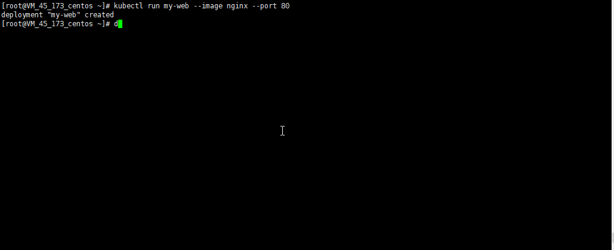
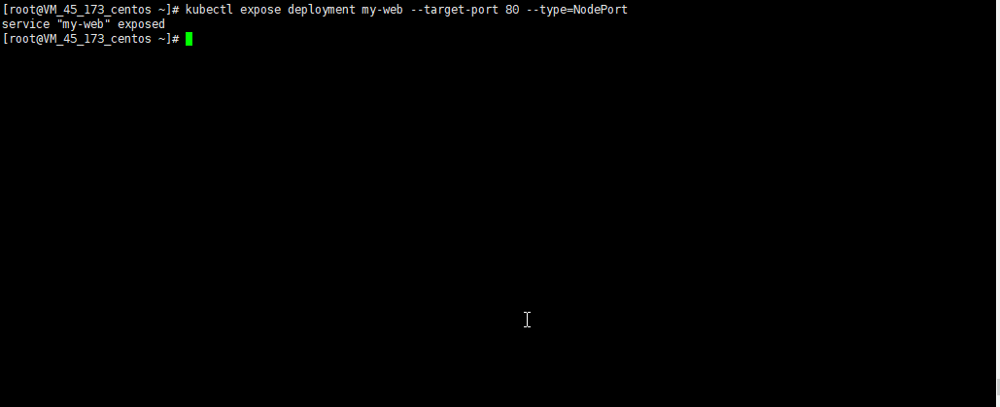
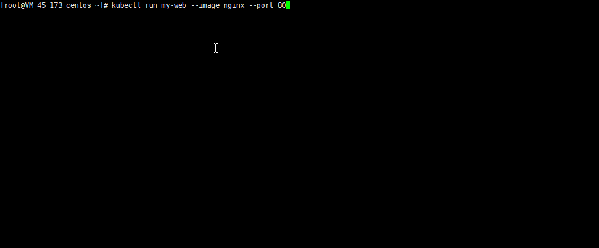

# 动手尝试kubernetes
之前是k8s的基础介绍，虽然概念上有了一些了解，但是没有实际动手看一下效果，很多东西其实都是没有那么清楚的。所以我们需要来自己动手试试。
## 一、搭建k8s环境
最简单的学习k8s的方式就是使用minikube，可以从官网找到minikube的安装方式，无论你是windows mac还是linux都有相关的安装方式。不过minikube只能用于学习，他只是快速搭建好一个运行在本机的master+node。如果要用于实际环境下还需要安装整套k8s。这里我就没有选择使用minikube。而是直接用了centos7的机器，因为centos7上可以直接通过yum安装，很遗憾ubuntu的apt不能直接安装kubernetes。
- 安装etcd和k8s
```
yum install etcd kubernetes *rhsm*
```
注：上面的操作会自动帮你安装好docker
- 关闭防火墙(如果只是本机测试不关也行)
```bash
systemctl disable firewalld
systemctl stop firewalld
```
- 修改配置`/etc/kubernetes/apiserver`
```
...
...
# KUBE_ADMISSION_CONTROL参数中去掉ServiceAccount
KUBE_ADMISSION_CONTROL="--admission-control=NamespaceLifecycle,NamespaceExists,LimitRanger,SecurityContextDeny,ResourceQuota"
```
- 按顺序启动服务
```bash
systemctl start etcd
systemctl start docker
systemctl start kube-apiserver
systemctl start kube-controller-manager
systemctl start kube-scheduler
systemctl start kubelet
systemctl start kube-proxy
```
- 安装完成查看版本和当前node
```
kubectl version
kubectl get node
```


- 安装python-rhsm？？  
因为yum安装的k8s有个docker用的是redhat的镜像，需要有红帽证书，只要安装这个东西才能连接红帽的网址，不然会说没有apiToken之类的
```
yum install *rhsm*
```


## 二、启动一个deployment
最小的调度单位虽然是pod，但是一般不是直接启动一个pod，而是启动一个RC或者deployment，让这个Deployment来自动创建和维护pod。例如创建一个名为my-web的deployment：
```
kubectl run my-web --image nginx --port 80
```
如果你是第一次运行，可能会等待较长时间，因为需要从redhat的仓库下载一个200M的镜像，还要从dockerHub下载一个nginx镜像。后者可以通过修改官方镜像地址来进行加速。
```
# /etc/sysconfig/docker
OPTIONS='--selinux-enabled --log-driver=journald --signature-verification=false --registry-mirror=http://ce796de6.m.daocloud.io'
if [ -z "${DOCKER_CERT_PATH}" ]; then
    DOCKER_CERT_PATH=/etc/docker
fi
```
如下图，副本个数默认值是一个，当我们用docker stop强行关闭容器的时候，会在几秒钟之内迅速启动一个，保持运行中的pod个数为1。

掌握指令
```
# 获取资源的相关信息
kubectl get [node/deployment/pod]

# 启动一个名为my-web的deployment,并指定docker镜像，暴露端口和副本数目（默认是1）
kubectl run my-web --image nginx --port 80 --replicas=1

# 缩放已经创建的rc/deployment监控的pod副本数
kubectl scale --replicas=4 deployment my-web

# 修改镜像，修改端口等，直接编辑保存后动态生效（在线更新，适用于各种资源）
kubectl edit deployment my-web
```

## 三、启动一个service
上面我们已经部署了一个应用my-web，但是我们其实并不能通过任何端口完成访问，虽然指定了80端口，但是`docker ps`信息中我们发现其实没有任何暴露的端口映射信息。我们还是需要创建service：
```bash
kubectl expose deployment my-web --target-port 80 --type=NodePort
```
外界可以通过暴露出的端口访问内部容器（这个端口默认随机生成可以通过--port指定一个30000+的端口）  
  
在集群中也可以直接通过clusterIP这个虚拟IP进行访问，但是注意只能访问暴露出的80端口，其他服务都不可用，包括ping：  
  
## 四、多个service之间如何通信
虽然通过查看clusterIP和端口可以进行访问，但是我们写程序的时候是不可能知道这个Ip的，如果要每次都配置的话，工作量太大，而且容易出错。k8s有两种方式来解决：环境变量和dns服务器。
### 1 环境变量
是指在每个pod中的docker容器启动的时候都会执行以下操作：查看kubernetes当前有哪些service，按照一定的格式将这些service的host和port生成环境变量。例如在创建pod的时候当前已有的service为mysvc1暴露了80端口此时在这个容器启动的时候就会加入环境变量
```
MYSVC1_HOST=这个服务的clusterIP 
MYSVC1_PORT=80
...
```

这样我们在写程序的时候只要按照这样的命名规范就能完成service之间的访问。这种方式不需要任何配置，就可以实现跨service通信。但是从这个环境变量设置的时机来看，会存在一些不能实现的情况。因为环境变量是容器启动的时候进行设置的，设置的也是这个时间节点上已经存在 service。

如果两个service之间想要互访：那service1的pod创建的时候需要service2已经存在，而service2的pod创建的时候需要service1已经存在，这就导致正常情况下无法同时满足1->2和2->1的访问。不过可以通过先设置1和2的deployment的replica=0，然后等service1和2都创建完成后，重新调整replica的值。

### 2 dns服务器
通过搭建dns服务器，将service和对应的ip自动放到这个dns服务器下，就可以实现直接通过服务名【域名】访问的效果。这个我还没有搭建过，因为网上的步骤略显复杂，就没有做尝试。
## 五、小结
我们了解了k8s在centos7下的快速搭建过程，虽然不是最新的k8s版本（当前最新是1.9），但是1.5也够用了，毕竟k8s更新太快了。并且我们还学习了如何通过kubectl指令创建deployment和service，也了解了这些资源创建的过程。除了纯指令创建，一种更为稳妥的方式是通过yml配置文件进行创建。


