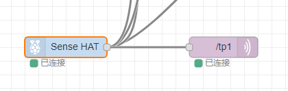
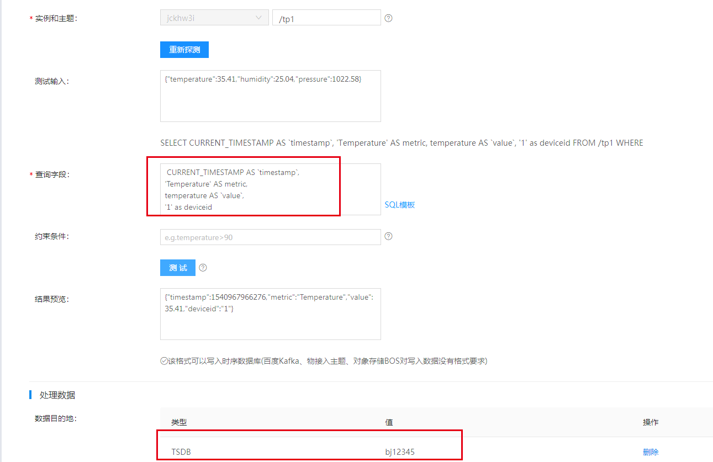
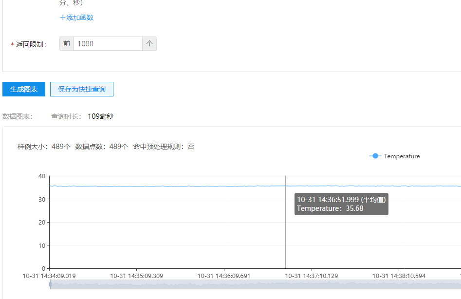

# 树莓派+百度云
完成一个小项目，用树莓派采集室内温湿度信息，然后上传到百度云，进行解析和存储。
# 1 温湿度采集
我利用sensorHat进行温湿度采集。然后转换为json格式。  
  
只需要将node-red中进行直连即可。
# 2 物接入
在百度云iot创建物接入服务，选择数据型，并创建身份和策略，对`/tp1`这个topic有订阅和发布权限的用户身份。然后将连接信息写入上面Node-Red配置中   
  
这样数据就传输到了mqttserver上。通过连接测试订阅该topic可以查看传上来的数据。

# 3 规则引擎
数据传上来之后，如果是byte数据则需要接入物解析进行格式转化为json。不过这个简单的demo中我们上传的就是json数据。所以直接接入规则引擎即可。  
  
注意这里的查询字段，需要是一个特定的格式，才能存入时序数据库。主要是当前时间，k，v，deviceid。这几个是都要有的，这里可能会有疑惑，多个k，例如温度和湿度怎么办？这种情况应该建立多个规则引擎，存入同一个数据库
```
 CURRENT_TIMESTAMP AS `timestamp`, 
'Temperature' AS metric,
temperature AS `value`,
'1' as deviceid
```
# 4 时序数据库
上面的数据目的地选择了时序数据库，从控制台可以直接查看数据图表  

# 5 小结
到这里我们将数据采集上传，存储，并展示了出来。