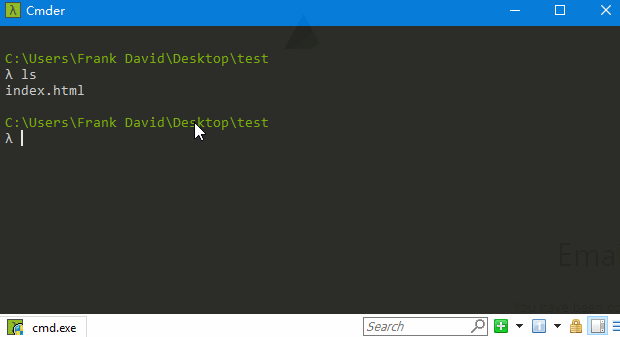
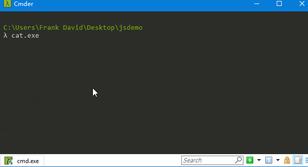

# zeit
现在serverless的服务可以说是越来越火了，除了最有名的aws的lambda，也有很多轻量易用的其他serverless服务。比如之前介绍的firebase就是，这里可以去参考下前面的文章。

firebase最大的缺点在于，谷歌的服务国内不能用。这里我们来介绍另一个不错的serverless---zeit产品。
# 服务方式
zeit的功能其实没有firebase那么丰富，他其实只提供了serverless服务。并且有三种形式：
- 1 static静态页面
- 2 node.js后台服务[需用zeit.micro的写法]
- 3 Dockerfile万能的使用方式

下面我们娓娓道来这几种使用方式，和他们的效果
# 0 安装
我们先安装zeit提供的cli---now。
```
npm install -g now
```
这个指令是从github下载编译安装，如果太慢可以直接访问[https://zeit.co/download#now-cli](https://zeit.co/download#now-cli)下载。

或者下载安装图形化界面也行[https://zeit.co/download](https://zeit.co/download)
# 1 静态页面
能将一个本地目录直接部署到云端http服务器下。  

# 2 node.js
按照micro的写法，详细写法可以参见[https://github.com/zeit/micro](https://github.com/zeit/micro)。可以驱动一个web后台服务。  

# 3 Dockerfile
一种万能的写法，只需要将要暴露的服务端口，在Dockerfile中指明EXPOSE xxx即可了。  

# 小结
zeit提供了灵活度极高的docker写法这一点远远强于firebase和lambda的必须用自己的语法。不过zeit的缺点在于厂子太小，没有提供数据库服务，在后台服务构建的时候还要借助aws等这样的第三方数据库。
