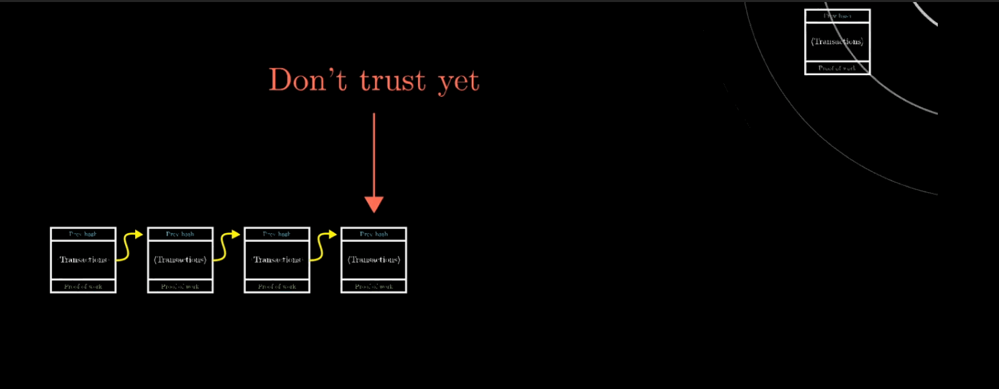

# 比特币--基于工作量证明的分布式账本系统
今天来整理下比特币。之前计网课分享过关于比特币的工作方式，以及区块链的相关知识。时间过去已经两年了，很多细节都有所忘记了，这里我们再来整理一下。
# 1 工作方式
比特币的工作方式就是`有一个账本`记录了交易记录，如下。然后每个人的余额只需要从账本中的交易记录就可以计算出来。    
  
## 1.1 问题1 如何防止记录伪造
每个人都可以在账本添加记录，如何防止伪造呢？`电子签名`每条Alice支付给别人的记录都需要有她本人的签名才行。就像上图中后面的斜体字。  

但是签名也可以伪造，所以需要更高级的电子加密签名，工作方式如下。**每个人有公钥私钥，每次交易记录的签名是对交易内容用私钥进行加密的签名（因而每次交易的签名都不同）。而验证签名是否是这个人的则只需要用这个人的公钥拿来检验下即可，私钥只能本人知道，公钥所有人都可以拿到。**  

通过以上的方式就`能保证交易记录不被篡改伪造`

## 1.2 问题2 如何防止添加同一条记录多次
上面说了不同记录签名一定不一样，但是同一条记录如果伪造了多次呢？解决方法十分简单，就是每条记录都有个唯一编号的，可以想象成递增。

## 1.3 问题3 账本谁来维护怎么维护
去中心化，是将账本交给每个用户去维护。例如Alice向Bob转10bit，那这个交易记录要`广播`给所有的其他人并在自己账本添加这条记录。

比特币是每十分钟会给账本后面追加一次这段时间的交易，这次追加的账本就是`区块链`。

重要概念：工作量证明。计算一个数学难题，这个难题易于证明结论的正确性，但是不易解。最简单的例如找一个数，把该数追加到本阶段的交易信息后面然后运行sha256后的二进制数前30位都是0.

这个数就是工作量证明，会放到区块链中，并且算出的hash值会作为下一个区块的头，这样可以保证已有的区块无法被篡改，因为篡改后hash值会变化，这样下一跳就接不上了，如下。
  

## 1.4 挖矿
矿工就是追加区块链的，他们的主要工作就是`聆听交易广播`、`计算一个数`、`广播新的区块链`。奖励就是能够在这个区块链的头部添加一条记录：自己获得xxx比特币，xxx是一个系统计算的值。以及这段时间内的交易手续费。下图就是矿工的工作内容。

## 1.5 普通用户
用户不用去挖矿，只需要聆听矿工广播出来的区块链追加到自己的记录中就行了。当然这也需要注意，如果听到了两份不同的区块链，那就选择链子更长那个，因为这个里面的工作量证明更大。如果两个一样长，那就等待下一次广播，取更长的。
## 1.6 欺骗有多难
假设Alice伪造了自己向Bob转100bit的记录。如果要想这条记录生效，那Alice必须在所有矿工之前找到一个数（挖到矿）。当然这也是有可能的，只不过Bob会收到两份区块链。一份是篡改的一份是其他矿工算出来的。根据1.5，此时需要等下一阶段的区款连广播。这一阶段Alice同样需要算出来，依次类推，Alice需要有能与全世界的矿工竞争的算力（5成以上）才能欺骗。  

# 郑重声明
本文大量借鉴视频[https://www.youtube.com/watch?v=bBC-nXj3Ng4](https://www.youtube.com/watch?v=bBC-nXj3Ng4)，感谢。