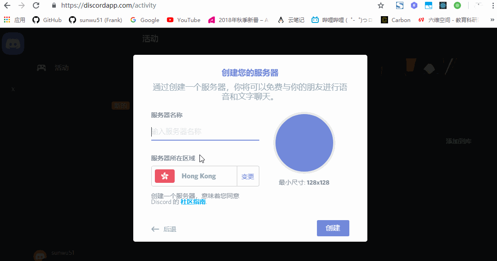
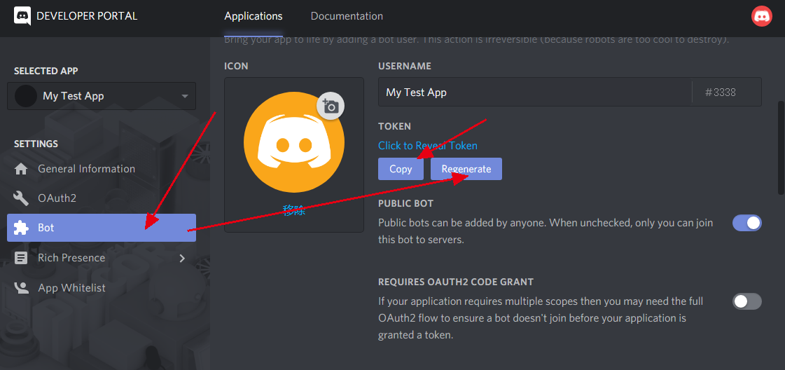

# discord
介绍一个老外用的挺多的聊天软件，以及这款免费软件的聊天机器人的开发模式。
# 1 注册
首先注册一个账号[https://discordapp.com/register](https://discordapp.com/register)


# 2 创建应用



# 3 创建另一个账户尬聊
下面这个gif，是刚连接还没有初始化（网络原因）所以一开始的话，没有及时收到，但是很快就调好了。
  
  
到这里我们创建了一个discord聊天室，并且能够互相聊天和拉人进群聊。

# 4 有趣的功能--webhook
添加通知到我们的聊天室里。例如github代码push后我想要在聊天室有个通知。我就可以这样设置。  
   

# 5 有趣的功能--chatbot
## 5.1 创建Application
在[https://discordapp.com/developers/applications/](https://discordapp.com/developers/applications/)创建Application。

## 5.2 添加bot
进入app界面，选择左边栏bot，添加bot，并生成token。

进入OAuth2栏，添加bot类型，生成url，然后进入url为聊天室授权bot.此时聊天室中多了一个bot成员

## 5.3 编写bot后台
想要让机器人能发消息或者执行其他后台功能，我们需要有个专门的后台程序。这里sdk提供了很多语言的，我们还是用最喜欢的nodejs。  

因为网络原因，我将这些代码写在了美国的服务器上。写到本机的话，可能会有网络问题。
```
npm i discord.js
```
我们写一段如下的程序
```js                                        
const Discord = require('discord.js');
const client = new Discord.Client();

client.on('ready',()=>{
    console.log('连接成功')
    client.user.setActivity(" chatbot")
})
client.on('message',(msg)=>{
    if(msg.author == client.user){
        return;//自己说的不用回复
    }
    // 如果输入hello，则返回 hi,xxx
    if(msg.content == 'hello'){
        msg.channel.send('hi,'+msg.author.toString())
    }
})

// xxx是刚才bot界面的那个token
client.login('xxxx')
```


