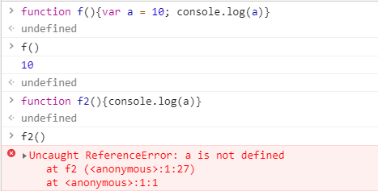
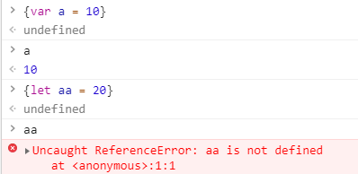
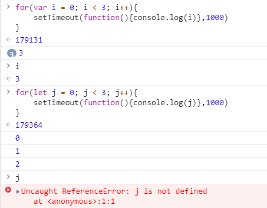

# js作用域
我们经常讨论js的作用域，比如经常会比较var let const三者声明变量后的区别。const是声明只读的常量的，所以主要的比较放在var和let。

`var是函数级别的`，函数内全都是一个。特殊情况是直接在最外面声明变量，这个级别可以认为是一个最外面的大函数。划重点：var是函数级别。下图中函数f中声明的变量a，在函数f2中就无法访问到：  


`let是代码段级别的`，通俗讲代码段就是大括号{}，函数当然也是一种代码段。直接一个大括号也是代码段。如下var在代码段中声明后，在外面也可访问，但是let就不行：  
  

# 关于for循环
for循环中使用let var会有不同的现象。  
  
我们还是套用我们前面的规律，var是函数级别的，for循环不是函数，所以说i是整个window级别的，所以1s后i变成了3。所以打印3个3。

而let是代码段级别的，在每个代码段（也就是for的循环体{}中)都是单独声明的一个变量。所以let的那段代码其实相当于：
```js
{
    let j=0;
    setTimeout(function(){console.log(j)},1000)
}
{
    let j=1;
    setTimeout(function(){console.log(j)},1000)
}
{
    let j=2;
    setTimeout(function(){console.log(j)},1000)
}
```
所以打印的是123.

如果用var也想打印123的话，可以用闭包
```js
for(var i = 0; i < 3; i++){
    (function(x){
        setTimeout(function(){console.log(x)},1000
    })(i)
}
```
闭包本质还是个函数，函数内这个x是每次传入的i，也就是123，所以最后打印123.


