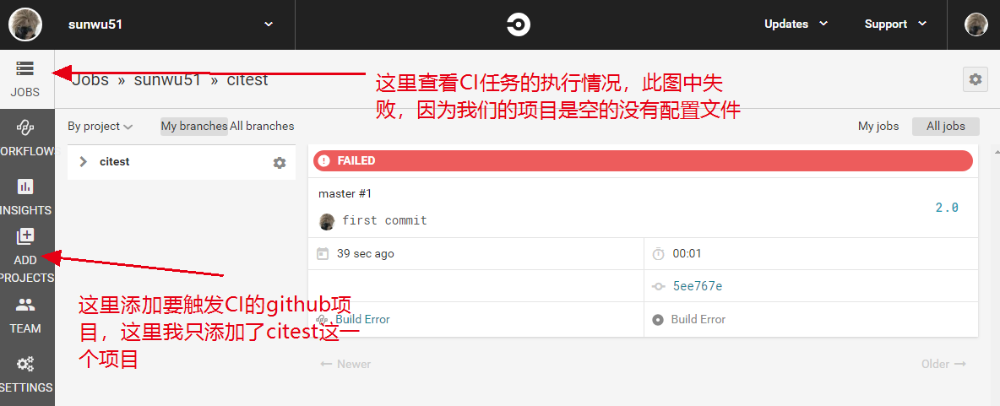
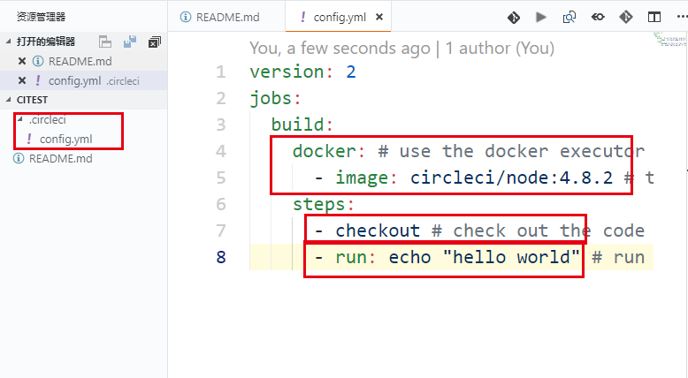

# circleCI
今天研究下circleCI。这款工具主要搭配github来使用，并且可以利用docker进行基础环境的构建。
# 主页面
注册登录后，看到如下的页面。我们关联（follow）一个自己的github项目--citest。

# 使用
因为citest项目一开始是没有任何配置的，所以就构建失败了。我们在这个项目的根目录下添加`.circleci/config.yml`文件，如下。

其中checkout是配置的保留字，可以拉取代码。这里使用的镜像是circleci团队给提供的。其实也可以是其他共有镜像。例如写成这样。

目前的功能只能用做CI，也就是做项目的构建和一些测试任务。如果要想部署，目前只提供了aws ecs的自动部署方式。
# 小结
circleCI和gitlab的runner非常像，都是用配置文件的方式声明使用什么docker镜像，并执行什么样的指令。CI工具比较复杂的在于临时数据库环境，和后续的部署上，这几点上都比较麻烦。