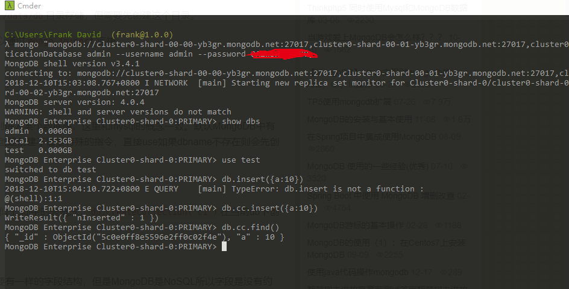

# mongodb atlas
atlas是啥呢？他就是mongodb官方提供的免费的mongodb数据库（集群）。有这等好事？是的。我们之前介绍了一个网站`mlab.net`也提供了免费的mongodb数据库，和官方的这个atlas类似。我们来看下官方提供的服务怎么使用吧。
# 使用atlas
1 首先在[https://cloud.mongodb.com](https://cloud.mongodb.com)注册一个账号。

2 然后创建一个集群，并且添加白名单ip和用户名密码

3 根据自己的连接方式，查看连接字符串或连接shell指令

# 小结
不知道是不是选择了新加坡的缘故，访问速度非常快，丝毫不卡。值得注意的是免费试用的套餐下，空间的大小只有512M。这个量有点少，稍微大一些的2G大小就需要9美元一个月了。

如果想要多个免费的集群就可以注册多个账号来搞，于是需要多个邮箱。可以参考18.11中email那篇中怎么使用僵尸邮箱来完成这个任务。