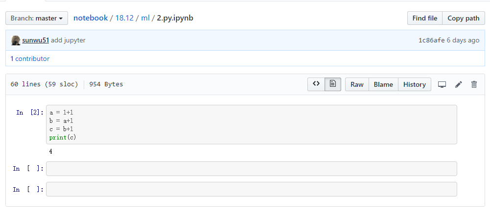
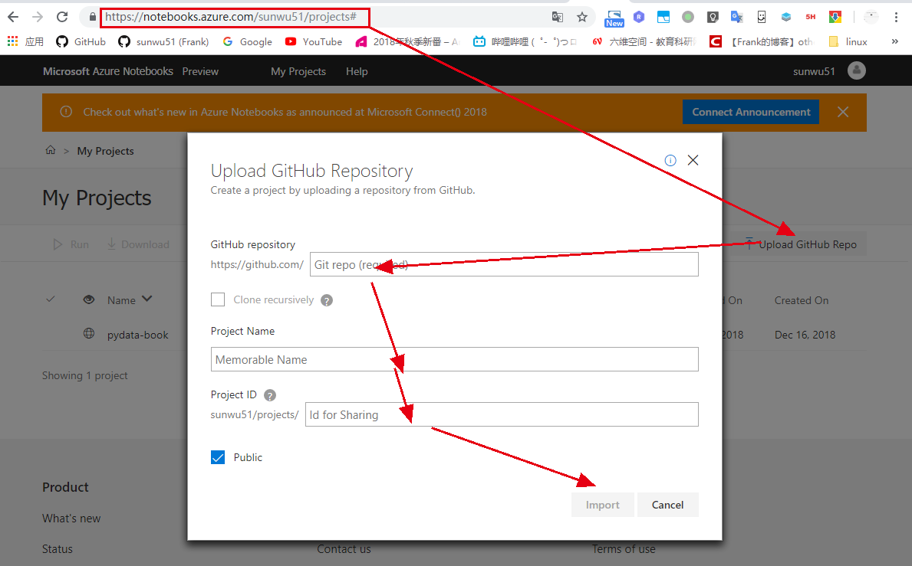

# jupyter
# 1 jupyter介绍与使用
`jupyter`很多人都用过，是能将python R等语言的代码的输入输出以很直观的形式显示的文本文件。格式为`ipynb`，github也能很好的解析这种格式的文件。例如[https://github.com/sunwu51/notebook/blob/master/18.12/ml/2.py.ipynb](https://github.com/sunwu51/notebook/blob/master/18.12/ml/2.py.ipynb)显示如下



其中的4是运行之后的结果，即改格式的文件能将运行后的结果输出显示在文件上面。

## 1.1 用处
在介绍怎么使用这种格式的文件之前，我们先来看下这样的形式有什么用处。

对于数据科学家来说，可以将输入和输出清晰的放到眼前，便于交流。这比直接在markdown中写上输入输出要更有说服力，因为这里的输出是真正运行后的结果，不存在造假。

对于学习者来说这个笔记本的在线版本（后面会说），可以修改输入，然后重新运行，查看输出的结果。是非常方便的在线运行工具。
## 1.2 使用
首先保证电脑具有python3.x环境。
```
$ python --version
Python 3.7.1
```
安装jupyter
```
pip install jupyter
```
新建一个目录，并在该目录下运行jupyter
```
mkdir test
cd test
jupyter notebook
```
会在8888端口启动一个web服务，并自动打开页面。  


在输入中可以写任意的python代码，包括import本地的包。
# 2 mybinder将代码仓库转为在线jupyter
在研究jupyter的时候发现一个非常有意思的工具mybinder，可以将代码仓库转换成一个在线的jupyter。就是说原来github中的ipynb格式的文件虽然能够解析，但是不能修改输入和重新运行，即不是在线的jupyter。
## 2.1 使用
访问[https://mybinder.org/](https://mybinder.org/),输入仓库地址，然后启动即可。这里我从github上随便找了一个jupyter格式的项目。     

## 2.2 依赖
上面的例子中我们看出可以将一个项目重新部署成在线jupyter，但是有个问题就是依赖的包会找不到。  
  
添加依赖的方式非常简单，就是在仓库的根目录下添加一个`requirements.txt`文件格式如下
```
numpy==1.13.1
matplotlib==2.0.2 
seaborn==0.8.1
```
如果不知道自己本地库的版本，或者不知道自己项目用了哪些库，可以直接`pip freeze > requirements.txt`会将所有的本地库和版本写到文件中。

有了这个文件后，就能很轻易的引入包了  
  
# 3 azure notebook
功能与上面的类似，不过是微软出品的。除了直接将仓库转为jupyter，azure notebook还可以普通的写日记，可以clone别人的日记项目，是一个更大的生态了。  
  
# 4 小结
上面的两个工具都非常有意思，但是我都不是很推荐使用，主要原因还是略微有点卡，因为服务器都在国外的原因。点击run后总要等待几秒钟才能看到输出。所以我还是建议直接将项目下载下来，然后在本地运行jupyter notebook。