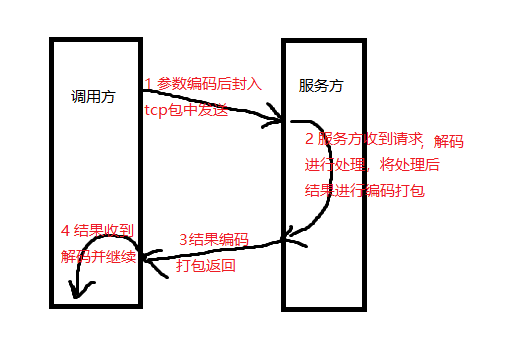

# rest & rpc
之前有人问我微服务和rpc有啥区别，感觉微服务所做的公司里的rpc框架都已经完成了。我想这个问题也是很多人心中想问的吧，其实呢。`微服务`和`rpc`不是一个层面的东西，微服务是一种构架思想，一种项目的组织方式。而rest是一种交互方式，基于http。微服务间交互方式可以是rest接口，虽然大多数时候是效率更高的tcp协议，但也有的比如grpc是用的http2.

总结一下就是微服务是一种项目组织方式，rpc是一种微服务间交互的方式，rest接口是一种rpc协议，还有其他很多框架内封装的基于tcp的协议。

# tcp vs http
在服务交互的时候，tpc和http各有什么好处呢？

首先http就是基于tcp的，直接用tcp交互，效率更高，这里指包的接收解析流程效率高。但是这也带来一个问题，就是数据的格式如何商定。接收方如何识别和还原发送方的数据，一般是需要商定一种编码和解码的协议。基于这种自定的高效编解码协议，tcp效率就更高了。

http交互效率差，但是不需要专门制定编解码方式，直接用json格式xml格式等这些"国际化"协议就可以进行交互。因此很多用http协议交互的微服务框架，甚至不需要任何rpc框架，直接可以接入进行交互http即可。

我们来看一种基于tcp的rpc协议的交互过程。  
  
然后是http的交互  
  

小结：tcp高效，但需要自己编解码。http利用json"编码"。

tcp适合更底层的服务，因为需要效率。http的则适用于小规模和更上层的服务交互。例如springCloud微服务交互就是http。

