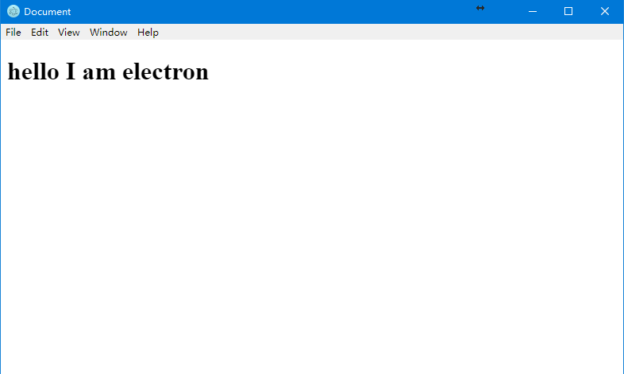

# JS能写什么
Atwood 定律：

“所有可以用 JavaScript 编写的程序，最终都会出现 JavaScript 的版本。”(Any application that can be written in JavaScript will eventually be written in JavaScript.)

一开始人们以为js就是**网页前端**的脚本语言主要用来操作dom和网页与服务端交互。

后来`nodejs`告诉我们原来js可以像python一样写**后台脚本**。同时还可以写**web服务端**。

在**游戏界**，js也早就是主流语言了，cocos和unity都默认支持用js来写。

似乎还有其他的漏掉的领域，移动端、桌面端。
# 移动端
js能写移动端吗？答案是肯定的，而且我知道的就有两种形式。

首先是前端框架的native版本，最有代表性的是`react native`。一套全新的js的移动端api和标签。这里我并没有写过react native，因为感觉学习代价还是蛮大的。感兴趣的可以自己去搜一下。

另一种实现方式简单一些，就是将html js css文件放到一个目录下，打包成一个app。在手机上运行，相当于挡住了url框的浏览器。[adobe phonegap build](https://build.phonegap.com/)就是最简单的在线转换工具，免费用户有一个app名额，你可以将自己的网站，放到一个目录下(记得留个index.html)进行打包zip，然后上传到这个网站，很快就能在线帮你转换成安卓 ios winphone平台的安装文件。
# 桌面端
js也能写桌面应用，他比较适合桌面显示性能要求低的应用。最典型的的js写的桌面应用如vs code就是js写的，网易云音乐，网易邮箱大师(桌面端)都是js写的。

可是js怎么下手写出一个桌面应用呢？
## 动手体验electron
vscode就是用electron这个框架写的，他是一个跨平台的可以将js css html转换成桌面端应用的框架。是github团队搞的。他的api并不复杂，主要的页面逻辑还是原生的dom js。
### 1 准备工作
新建文件夹electron-demo，在该目录下运行
```
npm init -y
npm install --save electron
```
将package.json中的script项进行修改
```
"scripts": {
    "start":"electron ."
}
```
### 2 创建app入口
```js
//index.js
const electron = require('electron');
const url = require('url');
const path = require('path');

const {app,BrowserWindow} = electron;

let myWindow;
app.on('ready',function(){
    myWindow=new BrowserWindow({});
    myWindow.loadURL("file://"+__dirname+"/myWindow.html")
})
```
app启动的时候会加载一个窗口，是基于当前目录下的`myWindow.html`这个文件加载的。
### 3 创建html文件 启动
```html
<!--myWindow.html-->
<h1>hello I am electron</h1>
```
在目录下运行指令 
```
npm start
```


## 更多细节
demo非常简单，就是将html文件展示到一个app中了。通过electron可以将这个app编译成二进制文件，如windows平台的exe文件。  

electron中一个html对应一个app中的窗口window，有点像单页应用。他不提倡使用网页中的模态框弹出，而是直接用一个可以控制大小的新的html窗口作为模态框。多个窗口之间可以通过ipcrenderer进行通信。  

electron除了可以将网页显示在app中，还可以用一些浏览器中无法使用的js库，如fs，mysql等等。可以在`<script>`中使用require语法引用安装的其他库。

详细的东西可以自己参考electron官网。

写图形化小工具的时候，electron会是一个非常轻量快速的选择。winform虽然开发也非常迅速，但是vs打开太慢，不是所有人都愿意装vs，也不是所有人都会c#，不能跨平台。python写图形化界面也还算方便借助python的qt库，不过安装和学习又需要一些代价。综合比较来看的话electron会是一个不错的选择。
