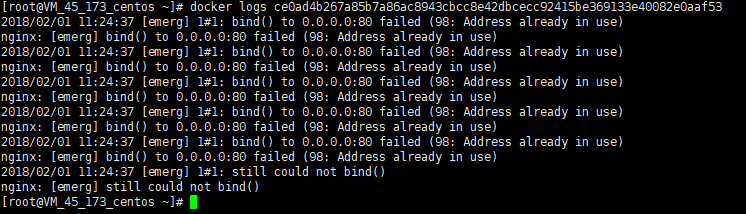

# 探究Pod
pod是k8s的最小调度单位，一般会说一个pod可能有一个或多个容器组成。每当我们创建一个pod的时候都会伴随创建一个基于`registry.access.redhat.com/rhel7/pod-infrastructure:latest`镜像的容器，以前好像是gcr上的一个pause镜像。可能我是centos下直接yum安装的原因，这个镜像变成了红帽的一个镜像。
## 共享IP
创建两个容器组成的pod一个是nginx一个是nodered(1880端口页面)
```
apiVersion: v1
kind: Pod
metadata:
  name: mypod
  labels:
    hello: world
spec:
  containers:
  - name: mycon1
    image: nginx
    ports:
    - containerPort: 80
    env:
    - name: HELLO
      value: 'WORLD'
  - name: mycon2
    image: sunwu51/node
    ports:
    - containerPort: 1880
    env:
    - name: XX
      value: zz
```
然后docker ps查看当前的容器列表  

当我们进入每个容器查看ip和hostname的时候发现，两个容器ip是一样的，并且hostname都是pod的name  
  
  
在一个容器中访问localhost就可以访问到另一个容器的服务，如在nodered的容器中可以访问localhost的80端口，就是另一个容器的nginx服务
  
如果，多个容器端口发生了冲突，会怎样呢？
```
apiVersion: v1
kind: Pod
metadata:
  name: mypod
  labels:
    hello: world
spec:
  containers:
  - name: mycon1
    image: nginx
    ports:
    - containerPort: 80
  - name: mycon2
    image: nginx
    ports:
    - containerPort: 80
  - name: mycon3
    image: sunwu51/node
    ports:
    - containerPort: 1880
```
发现mycon2这个容器创建失败,端口冲突  
  
如果将containerPort参数删掉,仍然不可以，可见只要是端口冲突就会失败。  

## 共享磁盘
共享Ip其实使用的是docker接口，让两个容器使用相同的ip，这样通过localhost就能访问其他端口的应用。而共享磁盘又是什么？
```
apiVersion: v1
kind: Pod
metadata:
  name: mypod
  labels:
    hello: world
spec:
  containers:
  - name: mycon1
    image: sunwu51/node
    ports:
    - containerPort: 1880
    volumeMounts:
    - name: mymount
      mountPath: /root/.pm2/logs
  - name: mycon2
    image: nginx
    command: ["sh","-c","tail -f /pm2logs/*.log"]
    ports:
    - containerPort: 80
    volumeMounts:
    - name: mymount
      mountPath: /pm2logs
  volumes:
  - name: mymount
    emptyDir: {}
```
还是刚才的例子nodered+nginx的pod。设置两个容器volumeMounts保持name一致，并分别设置目录。因为nginx容器的pm2logs是原来并不存在的，所以启动后会将nodered容器指定的目录挂载过来。
这里需要指定挂载的类型，此处制定的是empty类型，该类型，即一开始是个空目录，当pod删除后改空间消失，多用于容器见共享文件数据。  
注意先后循序：第一个挂载的目录作为挂载对象，会覆盖掉其他容器中指定的挂载目录下所有文件，所以一般后面的挂载目录都指定为空目录。

除了empty还有其他的挂载类型，比如hostPath，是同时挂载到实体机器目录下的，如下配置，当然还有很多其他的挂载方式。
```
volumes:
- name: mymount
  hostPath:
    Path: "/logs"
```


