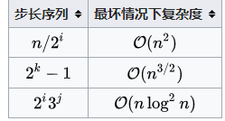

# 1 冒泡排序
从后往前，相邻两个比较，把小的放在前面。数次循环直到最小的已经都在前面。【冒泡把小的值逐渐的冒到最前面，一轮确定一个最小】
```
for(int i=0;i<arr.length;i++){
    for(int j=arr.length-1;j>i;j--){
        if(arr[j-1]>arr[j]){
            swap(arr,j,j-1);
        }
    }
}
```
简单的改进是添加一个flag表示本次内循环中是否发生了swap，如果发生了则flag=true，而flag为false 的时候直接退出外循环，当前结果已经是最后结果。

本身有序则走一遍n就搞定，本身反序则(n-1)+(n-2)+...1=n(n-1)/2次  

# 2 选择排序
遍历找到一个最小值，放到arr[0]，再在后n-1个元素遍历，选出最小放到arr[1]...
```
for(int i=0;i<arr.length;i++){
    for(int j=i+1;j<arr.length;j++){
        if(arr[j]<arr[i]){
            var t = arr[i]
            arr[i]=arr[j]
            arr[j]=t
        }
    }
}
```

# 3 插入排序
一个有序的序列，插入一个新值时，先和最后一个比较，如果大则直接放最后，如果小则和倒数第二个比，依次类推。是建立在一种原本是有序，后面插入新值的角度思考的。
```javascript
var tmp, j
for (let i = 1; i < arr.length; i++) {
    if (arr[i] < arr[i - 1]) {
        tmp = arr[i]
        for (j = i - 1; arr[j] > tmp; j--) {
            arr[j + 1] = arr[j]
        }
        arr[j + 1] = tmp
    }
}
```

# 4 希尔排序
思想为：首先将数组从中间分开，然后对应位置比较，将较小的放在前半（此时步长设为了len/2）。然后将步长缩短如变为len/4，然后还是对应位置比较，通过插入排序将越小的放在越前面。直到步长缩短为1，此时即等于插入排序。该算法通过前期跳跃性的移动节省了插入排序的交换次数，获的了比插入排序这种简单排序更好的复杂度。这个[视频](https://www.youtube.com/watch?v=CmPA7zE8mx0)可以快速风趣的了解希尔排序。
```javascript
var arr = [ 9, 1, 5, 8, 3, 7, 6, 4, 2]
var gap, i, j; //gap步长
var temp;
for (gap = arr.length >> 1; gap > 0; gap >>= 1){//步长一开始是数组长度/2，每次缩小一半
    for (i = gap; i < arr.length; i++) {//将第一组外的数进行遍历
        temp = arr[i];
        //下面三行代码：每一列同一位置的元素进行比较.将较小的放在前面.插入排序，只不过步长是gap
        //可以对比上面的插入排序，比较异同
        for (j = i - gap; j >= 0 && arr[j] > temp; j -= gap)
            arr[j + gap] = arr[j];
        arr[j + gap] = temp;
    }
}
```
# 5 堆排序
利用存储结构堆，堆是一种完全二叉树，每个节点的孩子都比自己小，这就是大顶堆，反之小顶堆。用大顶堆存储数据，然后逐个弹出根节点，就是从大到小的顺序排列。
```javascript
function swap(i, j) {
	var tmp = arr[i];
	arr[i] = arr[j];
	arr[j] = tmp;
}

function max_heapify(start, end) {
	//建立父節點指標和子節點指標
	var dad = start;
	var son = dad * 2 + 1;
	if (son >= end)//若子節點指標超過範圍直接跳出函數
		return;
	if (son + 1 < end && arr[son] < arr[son + 1])//先比較兩個子節點大小，選擇最大的
		son++;
	if (arr[dad] <= arr[son]) {//如果父節點小於子節點時，交換父子內容再繼續子節點和孫節點比較
		swap(dad, son);
		max_heapify(son, end);
	}
}

var len = arr.length;
//初始化，i從最後一個父節點開始調整
for (var i = Math.floor(len / 2) - 1; i >= 0; i--)
	max_heapify(i, len);
//先將第一個元素和已排好元素前一位做交換，再從新調整，直到排序完畢
for (var i = len - 1; i > 0; i--) {
	swap(0, i);
	max_heapify(0, i);
}
```

# 归并排序
分治思想，将数组中相邻俩数组成一组，一共len/2组，每组俩数排序。然后将相邻两组合并为一组，因为组内已经排好序了，所以合并的时候有些简化的操作（从a和b组中依次拿出最小的，看谁的更小，作为新组的小值，然后次小...）
```javascript
Array.prototype.merge_sort = function() {
	var merge = function(left, right) {
		var final = [];
		while (left.length && right.length)
			final.push(left[0] <= right[0] ? left.shift() : right.shift());
		return final.concat(left.concat(right));//当left或right中一个长度为0的时候，直接连接起来
	};
	var len = this.length;
	if (len < 2) return this;
	var mid = len / 2;
	return merge(this.slice(0, parseInt(mid)).merge_sort(), this.slice(parseInt(mid)).merge_sort());
};
```

# 快速排序
同样利用分治的思想，将第一个数取出来作为mid，然后后面的和他比较，大于他的归为一组，其他归为一组。然后第一组一定是所有元素排在第二组所有元素后面的。将第这两组进行同样的操作，一直到最后每组大小为1.
```javascript
Array.prototype.quick_sort = function() {
	var len = this.length;
	if (len <= 1)
		return this.slice(0);
	var left = [];
	var right = [];
	var mid = [this[0]];
	for (var i = 1; i < len; i++)
		if (this[i] < mid[0])
			left.push(this[i]);
		else
			right.push(this[i]);
	return left.quick_sort().concat(mid.concat(right.quick_sort()));
};
```

# 复杂度问题
这里时间复杂度只讨论均值。  
前三种为简单排序，平均时间复杂度都是O(n2)【n的平方】。shell排序在步长不同的情况下不同  
  
堆排序时间复杂度`O(nlogn)`，空间复杂度`O(1)`  
归并时间复杂度`O(nlogn)`,空间`O(n)`  
快速时间复杂度`O(nlogn)`,空间`O(n)`优化后空间复杂度更低  
 

