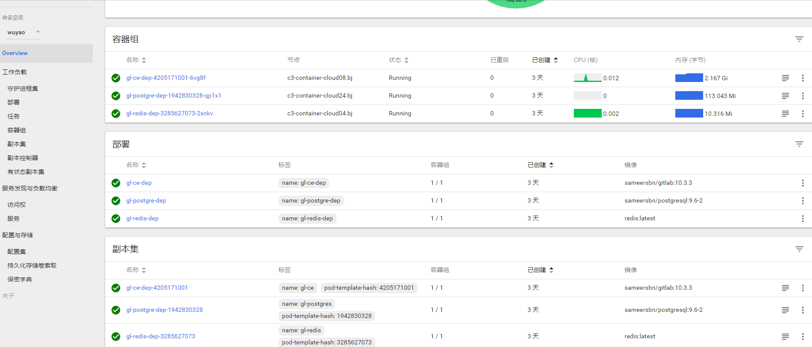

# gitlab安装在k8s集群
## 1 注册账号登陆k8s
在[网站](https://cc.d.xiaomi.net/index.html#/)(只限内网)登陆，并根据相应的指示运行添加账号和namespace。添加完成后可以直接进入k8s操作面板。
## 2 创建deployment和service
在操作面板的右上角有创建按钮，可以直接通过上传yml文件进行创建，注意kubectl create -f是forbidden，只能通过这个网页进行操作。依次创建以下deployment和service
- [redis-dep](gitlab-install/redis-dep.yml)
- [redis-svc](gitlab-install/redis-svc.yml)
- [post-dep](gitlab-install/post-dep.yml)
- [post-svc](gitlab-install/post-svc.yml)
- [ce-dep](gitlab-install/ce-dep.yml)
- [ce-svc](gitlab-install/ce-svc.yml)  

## 3 创建ingress
服务创建好之后只能在集群内通过clusterIP进行访问，想要在集群外访问这个地址还需要建立ingress路由。
- [ingress](gitlab-install/ingress.yml) 

上面的配置就是将a.b.c这个域名指向了ce-svc的80端口。不过我们还需要在自己的电脑hosts中配置下，将a.b.c这个域名指向ingress服务器的ip。这样当我们访问a.b.c的时候就会指向ingress服务器，然后根据http请求头中的host为a.b.c，ingress就会将其解析到ce-svc:80，完成代理。

