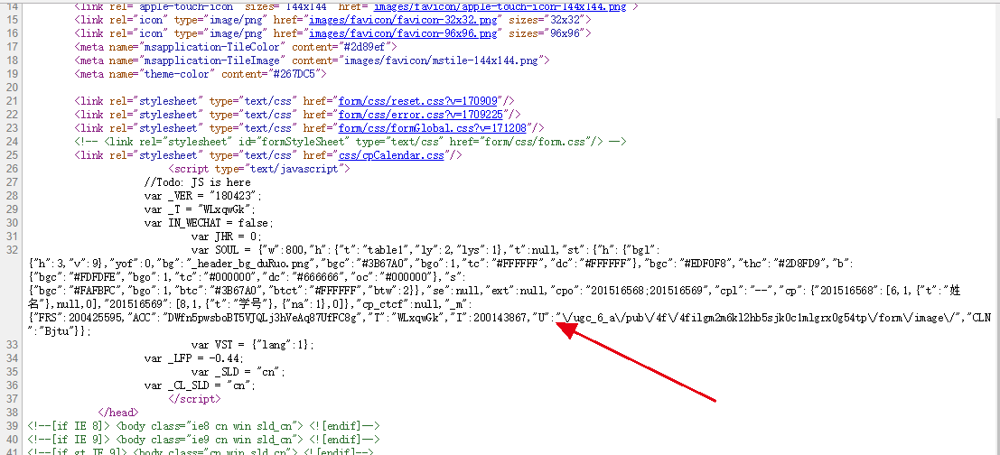
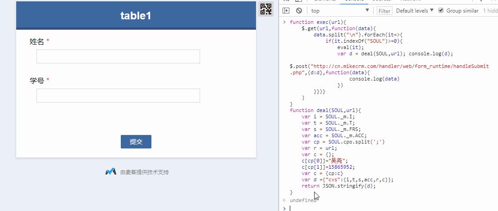

# 北交大前沿讲座抢课
# 如何用脚本来帮你抢前沿讲座
自己注册一个麦客表单，建立一个表单。然后提交一次看看http请求的内容：


然后把这个请求的内容用rest请求工具（restlet、postman都可以）提交一次看看是否也能成功。  


我们来仔细研究下这个表单中提交的这个数据d中的内容：
```json
{
	"cvs": {
		"i": 200143867,
		"t": "WLxqwGk",
		"s": 200425595,
		"acc": "DWfn5pwsboBT5VJQLj3hVeAq87UfFC8g",
		"r": "http://cn.mikecrm.com/WLxqwGk",
		"c": {
			"cp": {
				"201516568": "小明",
				"201516569": 12211014
			}
		}
	}
}
```
从刚才的url我们没有发现和我们的表单相关的东西，可以看出所有的表单提交都是提交到这个url的，而具体的表单区分和表单内容全在上面这个json文本中。

其他字段是怎么来的呢？我们再次打开刚才的表单填写页面，通过查看源码可以看到有这样一段脚本。  
  
于是找到对应关系：  
这个SOUL变量的最后一个字段如下：
```json
{
    "FRS":200425595,
    "ACC":"DWfn5pwsboBT5VJQLj3hVeAq87UfFC8g",
    "T":"WLxqwGk",
    "I":200143867,
    "U":"\/ugc_6_a\/pub\/4f\/4filgm2m6kl2hb5sjk0c1mlgrx0g54tp\/form\/image\/",
    "CLN":"Bjtu"
}
```
这里的FRS对应提交的s字段，I对应i字段，ACC对应acc，T对应t。
这里SOUL中有个cp或者cpo字段中有`"201516568;201516569"`正是提交的字段中cp的key，value则是填写的值。最后是提交的r字段，这个就是当前表单的url。

我们在抢课开始前几分钟的时候，要用电脑浏览器打开“阅读全文”的网址，并把这个网址复制下来。然后F12打开Console，复制以下代码进去，回车。然后`exec(window.location.href)`就是选课一次了。
```javascript
function exec(url){
    $.get(url,function(data){
        data.split("\n").forEach(it=>{
            if(it.indexOf("SOUL")>=0){
                eval(it);
                var d = deal(SOUL,url);
                $.post("http://cn.mikecrm.com/handler/web/form_runtime/handleSubmit.php",{d:d},function(data){
                    console.log(data)
                })
        }})}
    )
}
function deal(SOUL,url){
    var i = SOUL._m.I;
    var t = SOUL._m.T;
    var s = SOUL._m.FRS;
    var acc = SOUL._m.ACC;
    var cp = SOUL.cpo.split(';')
    var r = url;
    var c = {};
    c[cp[0]]="你的名字";//姓名
    c[cp[1]]=123213;//学号
    var c = {cp:c}
    var d ={"cvs":{i,t,s,acc,r,c}};
    return JSON.stringify(d);
}
```
如果想要每秒帮忙选一次则可以
```javascript
setInterval(function(){exec(window.location.href)},1000)
```

# 注意！
后来发现如果表单倒计时开始抢的时候，会自动刷新一次页面，导致写好的脚本丢失。所以建议在一个旧的表单页面(例如[http://cn.mikecrm.com/zHx5Dh9?iro=1](http://cn.mikecrm.com/zHx5Dh9?iro=1))中运行上面的脚本，并将`window.location.href`改成当天新推的表单的网址。

小结：在一个旧表单页面F12在console复制上面的脚本。记得修改三个地方：姓名/学号/window.location.href。回车运行，等待表单开始填写，脚本会自动帮忙提交~