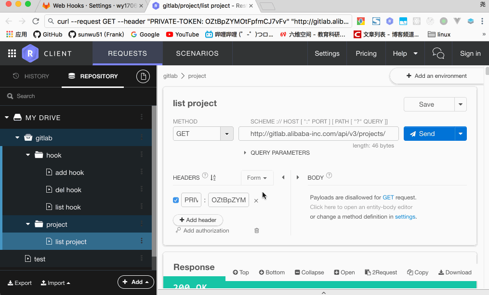

# Gitlab hook
## 目标
通过脚本为多个项目自动化添加webhook。

## 思路
- 第一步：调用gitlab的api，列出当前用户的所有项目。然后通过namespace或者project name来过滤需要添加hook的项目名或项目id（因为有些个人项目可能不想加hook）。

- 第二步：根据项目id+个人token请求hook相关的接口，可以对当前项目的hook进行增删该查

## 测试


## 代码
[nodejs脚本](src/)
填写配置文件，在src目录下运行
```
npm run start
```

## commit规范
[原来定的消息规范](https://lark.alipay.com/alwxtc/lgqsep/ukd8yy#%E4%BA%8C%E3%80%81%E6%B6%88%E6%81%AF%E8%A7%84%E8%8C%83%E7%BB%86%E5%88%99)  
[anoe自动fix缺陷的格式](https://lark.alipay.com/aone/platform/bl0h8r)

因而我们只需要在原来的消息规范的基础上，在消息的末尾增加
```
to/fix #xxx,#yyy
```
例如
```
【Fix】【<scope>】<subject>

 Reason: xxx
 Solution: xxx

 CLOSE: #123, #245, #992
 fix #123,#245,#992
```
