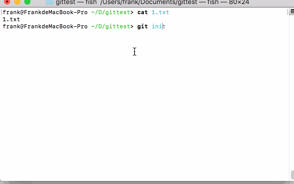
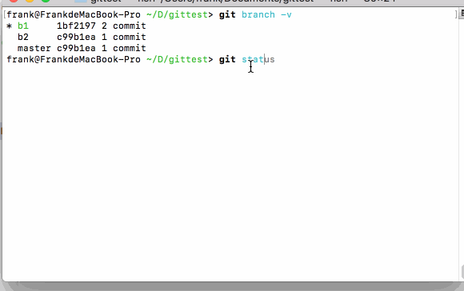

# git分支相关指令
```bash
# 新建分支b1（在当前分支基础上创建的）
git branch b1

# 在b1分支的基础上新建b2分支
git branch b2 b1

# 转到分支b1
git checkout b1

# 当前分支上新建分支b1，并直接转到b1分支上
git checkout -b b1  

# 在b1分支上新建b2分支，并直接转到b2（和branch指令的顺序反）
git checkout b1 -b b2

# 删除b1分支
git branch -d b1

# 合并b1分支到当前分支
git merge b1
```
## 合并冲突的解决
```bash
git merge b1
Auto-merging 1.txt
CONFLICT (content): Merge conflict in 1.txt
Automatic merge failed; fix conflicts and then commit the result.
```
merge后提示冲突，此时会将冲突的文件部分进行重写，格式为
```
<<<<<<< HEAD
Creating a new branch is quick & simple.
=======
Creating a new branch is quick AND simple.
>>>>>>> b1
```
只需要改为想要的结果，可以是任意其中一个，也可以是一个新的写法。然后commit即可解决冲突。
## git log
用树状图的方式简洁的查看提交瀑布图
```
git log --graph --pretty=oneline --abbrev-commit
```
# git撤销与回滚相关
我们知道本地git仓库有三大区域：工作区、暂存区、仓库。  
先了解checkout和reset
- 工作区 add 暂存区 commit 仓库区
- checkout 分支名        将仓库区的HEAD指针指向该分支的最新提交cm，工作区也变成cm。
- checkout 提交名        将仓库区的HEAD指针指向这次提交cm，工作区也变成cm。
- checkout 提交名 文件名  将该cm的文件刷出到工作区。

我们看出checkout是`从仓库直接刷出到工作区的，他可以直接修改工作区文件`。我们来想一下特殊情况，首先创建一个本地git仓库，并创建b1，b2两个分支。他们内容一样。  
  
正常情况下，我们屁股擦干净（git status为空）的情况下，切换到另一个分支，文件被直接替换。


`checkout 分支`的时候，如果屁股没擦干净，会怎样：  
  

我们发现，如果是有侵入性的修改文件和checkout后的文件内容冲突，此时检出直接失败。如果是创建新的文件这种不影响co后文件内容的，则可以成功，并且会保留这个文件。

到这我们记住1条原则，**就是我们做的所有改动都会被记录，凭空消失是不可能的（除非force参数），修改不能凭空消失又要检出指定分支的内容两个目的冲突所以失败了，创建的文件不能凭空消失，检出的文件内容没有这个文件，所以可以共存。** 

`checkout 提交名`和分支名类似。对此我们的建议是在checkout之前最好是把屁股擦干净，这样可以解除后顾之忧。

`checkout 提交名 文件名`这里的作用只是操作单文件，并不改变HEAD的位置，将该commit中文件内容直接替换工作区的文件内容。不涉及任何版本改变啊，冲突啊，之类的操作。就是找到历史记录，拷贝，替换当前文件内容。

- reset 提交名         仓库区HEAD指向该提交
- reset 提交名 文件名   一般只用 git reset HEAD 文件名 清缓存区专用

## 场景
1 改了文件，没有add，想撤回
```bash
git checkout HEAD filename
```
2 改了文件，已经add，没有commit，想撤回
```bash
# 清缓存区
git reset HEAD filename
# 回到了1的情况
git checkout HEAD filename
```
3 已经commit了，想全部撤回
```bash
git reset --hard HEAD^
```
4 3中的情况，想撤回单个文件，重新提交
```bash
git reset HEAD^

# 回到了1的情况
git checkout HEAD filename
```
5 commit之后发现，漏掉一个文件，想补加到上一次提交上
```bash
git add filename
git commit --amend -m "新提交,会替换之前的提交名"
```
6 提交到远程，发现代码有问题，要回滚
```bash
# 方法一：强制提交，之前提交的版本被删除，消失
git reset --hard HEAD^
git push origin master -f

# 方法二：revert放弃一个版本，但这个放弃操作是一条commit，保留之前所有提交
git revert HEAD
git push origin master
```