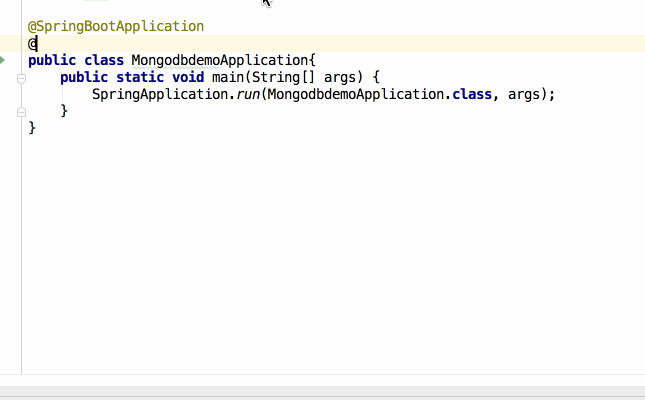

# cron
cron是linux下的定时执行任务的服务。
# cron表达式
七段 
```
秒 分 时 日 月 星期几 年
```
这里其实比较恶心的是星期的引入，他也表示哪一天，所以和日字段，有冲突，两者不能同时指定，七段中*指任意一天，也算指定，？则不算指定。所以这两个字一般至少有一个是问号?。问号同时也是只有这俩天字段能用的。这种问号的形式可能不适用于后面的五段式。

【注意】取值范围秒分0-59，时0-23，日1-31，月1-12，`星期1-7但是1是指周天，2是周一依次类推`（歪果仁觉得周天是一周的第一天...）

常用的其他符号有：
- [* 表示每一xx都可以执行，典型例子 * * * * * ? * 代表每秒钟都能执行。]
- [- 表示范围内每一xx都可以执行，典型例子1-3 * * * * ? * 代表每分钟的01/02/03秒各执行一次。]
- [, 表示或者。典型例子1,3,5 * * * * ? * 代表每分钟的01/03/05秒各执行一次。]
- [x/y 表示从第几x开始每y执行一次。典型例子 1/30 * * * * ? * 代表从01秒开始之后每30s执行一次。]


六段的表示方法也有，是没有上面的年。
```
秒 分 时 日 月 星期几
```

也有五段的，crontab中用的就是五段，在六段的基础上没有秒
```
分 时 日 月 星期几
```
# 实例


上图中可以看出crontab不支持?。直接用*同时指定日和周就可以。

# Spring Boot中配置定时任务
1 在启动类添加注解@EnableScheduling
2 在任意一个SpringBean类中写定时执行任务的方法
3 在这个方法上添加@Scheduled注解，该注解支持的参数可以是一个cron表达式(六段)，也可以是设置执行周期和初次执行延时。


