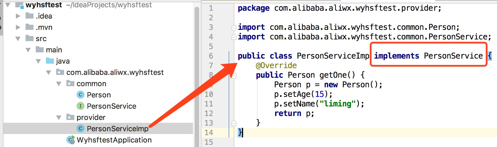
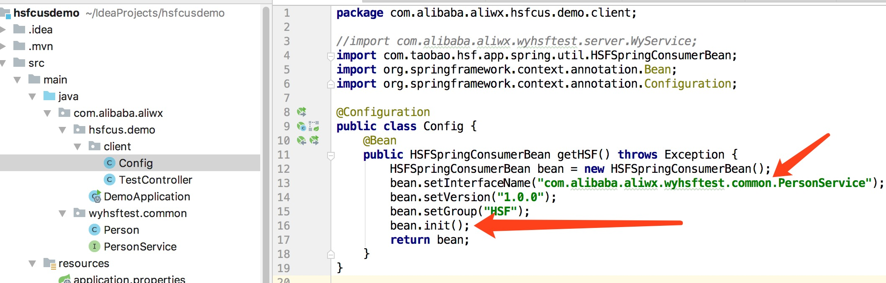

# alibaba HSF
# 1 简介
HSF是RPC框架，RPC是干啥的呢？就是远程服务端的一个服务，你调用完了获取相应的结果。最常见的RPC就是http了，我们发起一个请求，httpserver执行完，返回相应的结果给我们。但是http是应用层协议，RPC为了性能更多的会用TCP协议。
# 2 在阿里巴巴内部使用HSF
## 2.1 编写服务生产者
maven依赖：
```xml
<dependency>
    <groupId>org.springframework.boot</groupId>
    <artifactId>spring-boot-starter-web</artifactId>
</dependency>
<dependency>
    <groupId>com.alibaba.middleware</groupId>
    <artifactId>hsf-guide-api</artifactId>
    <version>1.0.0-SNAPSHOT</version>
</dependency>
<dependency>
    <groupId>com.taobao.hsf</groupId>
    <artifactId>hsf-all</artifactId>
    <version>2.2.5.8-SNAPSHOT</version>
</dependency>
```
先写service接口和用到的模型类，并将这些封装到一个common包中，这个包还会提供给消费者使用。


然后写service接口实现类：  


最后将`实现类`按照`接口的类全名`注册到阿里内部的hsf系统：  
  
这里默认就是注册到阿里内网日常环境，然后序列化一般就用这个类型就行，比较中庸，其他序列化方式可以参考手册，各有所长。
## 2.2 在内网web界面测试接口
[搜索和测试接口页面](http://hsf.alibaba.net/hsfops/serviceSearch.htm?envType=daily&filter=service)    

## 2.3 编写服务消费者
新建另一个spring项目，maven依赖和生产者一样即可，然后需要添加之前的common包，可以是jar包，也可以直接原封不动的文件拷过来（注意包名不要变了）


配置消费Bean：  

这里用了`HSFSpringConsumerBean`这个类，他和`HSFApiConsumerBean`效果是一样的，上面的生产者的Bean也是同理。

从bean中获取target服务实现对象并使用：  


