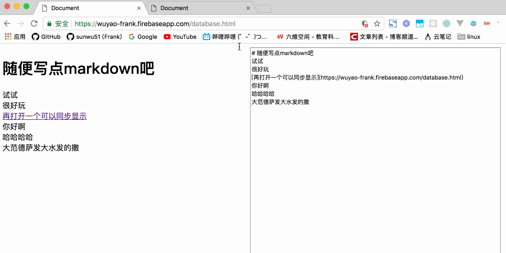

# firebase
firebase是谷歌的一个`paas`服务部分存储的内容同样可以在gcp的控制台看到。基于这个平台可以大大简化我们开发的复杂度，尤其是移动端app以及其后台的开发。
这一系列的文章的观看顺序应该是如下：
- hosting
- storage
- database
- function
这样由简单到复杂，慢慢了解各部分功能和解决的主要问题。首先使用谷歌账号登录firebase控制台，[https://console.firebase.google.com/](https://console.firebase.google.com/)创建一个应用，然后需要本地安装firebase工具`npm install -g firebase`
# database
# 写数据
左侧develop->Database，创建自己的数据库  
```JavaScript
// Initialize Firebase
var config = {
    apiKey: "填自己的",
    authDomain: "填自己的",
    databaseURL: "填自己的",
    projectId: "填自己的",
    storageBucket: "填自己的",
    messagingSenderId: "填自己的"
};
firebase.initializeApp(config);
function writeUserData(userId, name, email) {
  //这里不需要提前创建可以自动创建users表
  firebase.database().ref('users/' + userId).set({
	username: name,
	email: email
  });
}
```
实时数据库是firebase提供的最主要功能之一，我们从上面的例子发现这是一个类似mongodb的nosql的json数据库，除了基本增删改查，这个数据库还有个“实时性”，每个客户端是socket连接的服务端，可以监听数据的变化进行实时改变。 

# 读数据
```javascript
var userId = firebase.auth().currentUser.uid;
return firebase.database().ref('/users/' + userId).once('value').then(function(snapshot) {
  var username = (snapshot.val() && snapshot.val().username) || 'Anonymous';
  // ...
});
```
# 监听数据变化
value事件是监听值得变化
```javascript
var starCountRef = firebase.database().ref('/users/' + userId);
starCountRef.on('value', function(snapshot) {
  updateStarCount(postElement, snapshot.val());
});
``` 
# demo
我们来写一个有趣的demo,做一个网站，这个网站只有一句话。三是可编辑的，当我们编写或修改这句话的时候，会实时同步到firebase的实时数据库中。在其他地方打开这个网页也能同步的看到变动。思路就是，编写的时候：监听input的onchange事件，向数据库提交改动。显示的时候，监听数据库的变动，向dom中更新文字。
顺带加个markdown解释器吧，源码在code下，效果如下：


