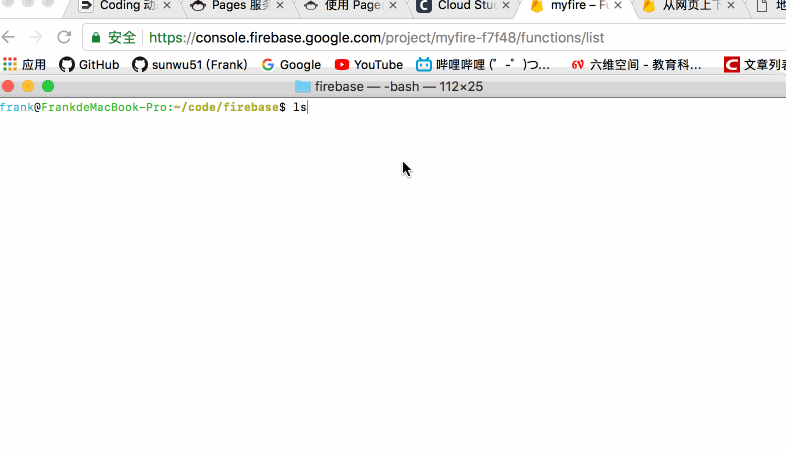

# firebase
firebase是谷歌的一个`paas`服务部分存储的内容同样可以在gcp的控制台看到。基于这个平台可以大大简化我们开发的复杂度，尤其是移动端app以及其后台的开发。
这一系列的文章的观看顺序应该是如下：
- hosting
- storage
- database
- function
这样由简单到复杂，慢慢了解各部分功能和解决的主要问题。首先使用谷歌账号登录firebase控制台，[https://console.firebase.google.com/](https://console.firebase.google.com/)创建一个应用，然后需要本地安装firebase工具`npm install -g firebase`
# function
FAAS服务的一种实现，通过写一个函数，然后将函数上传，这个函数就能运行了，一般函数是个http的接口。直接看图吧
  

  