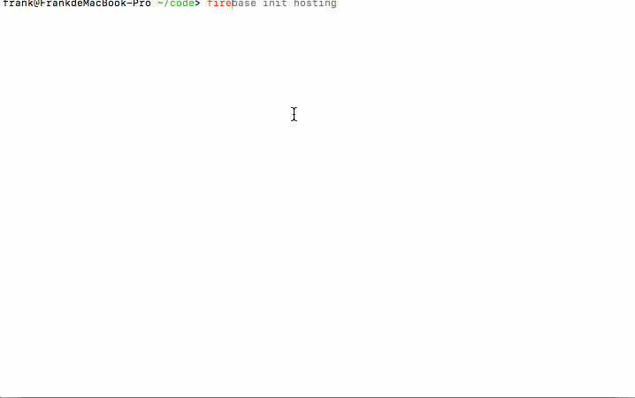

# firebase
firebase是谷歌的一个`paas`服务部分存储的内容同样可以在gcp的控制台看到。基于这个平台可以大大简化我们开发的复杂度，尤其是移动端app以及其后台的开发。
这一系列的文章的观看顺序应该是如下：
- hosting
- storage
- database
- function
这样由简单到复杂，慢慢了解各部分功能和解决的主要问题。首先使用谷歌账号登录firebase控制台，[https://console.firebase.google.com/](https://console.firebase.google.com/)创建一个应用，然后需要本地安装firebase工具`npm install -g firebase`
# hosting
本篇是hosting的使用，hosting的作用就是一个静态的网页服务器，你只需要上传自己的静态文件(html/js/css等)，然后返回一个url，通过这个url就能访问你的静态资源了。
创建一个空目录`fire`,然后在这个空目录下运行【下面有gif图】
> 1 登录firebase,会弹出网页登录谷歌账号
>> firebase login

> 2 初始化当前目录为hosting项目,会生成一些文件，默认有public/index.html文件
>> firebase init hosting

> 3 部署上线，最后会打印上线后的url地址，直接访问就有了
>> firebase deploy --only hosting

> 4 修改public下的静态文件，再次部署

全球各地都有cdn所以速度很快

