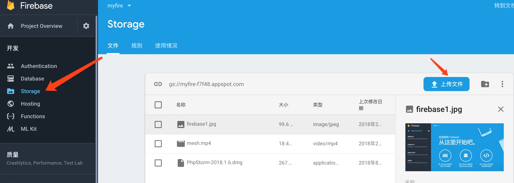

# firebase
firebase是谷歌的一个`paas`服务部分存储的内容同样可以在gcp的控制台看到。基于这个平台可以大大简化我们开发的复杂度，尤其是移动端app以及其后台的开发。
这一系列的文章的观看顺序应该是如下：
- hosting
- storage
- database
- function
这样由简单到复杂，慢慢了解各部分功能和解决的主要问题。首先使用谷歌账号登录firebase控制台，[https://console.firebase.google.com/](https://console.firebase.google.com/)创建一个应用，然后需要本地安装firebase工具`npm install -g firebase`
# storage
顾名思义就是存储，主要是用来存储文件，基本上可以理解为一个网盘，可以通过web或各端上传，也可以下载。
## 页面上传/url下载
直接通过控制台的web页面就可以上传文件，值得一提的是虽然服务是谷歌的但是上传速度非常快大约2-3M/s。

另外通过点击文件，可以查看文件信息其中有一项是文件位置，这里面就包含了一个文件下载链接

## 关于规则
在上方可以看到，规则这一栏，默认的规则如下
```rules
service firebase.storage {
  match /b/{bucket}/o {
    match /{allPaths=**} {
      allow read,write: if request.auth != null;
    }
  }
}
```
其中指明了所有路径的规则是读写都需要认证，注意这里的读写是指gs://的这个地址的读写，上面提到的url下载是一直可以下载的，如果不想被下载，可以撤销下载网址。可以根据自己的需要修改权限，也可以根据匹配路径配置不同权限，详细的就不展开了。
## 通过web上传文件
可以参考./code下的文件，效果如下图

上传完成后页面自动生成下载链接。


