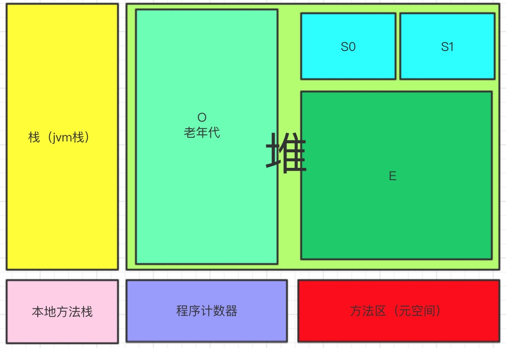

# jvm内存模型（jdk8)
jvm内存模型主要分为5个部分，`程序计数器`、`本地方法区`是两个程序员不用在意的区域，`堆`是new对象保存的内存区，`栈`是方法运行变量暂存区运行完会释放掉，`方法区`在jdk7及以前有一种叫永久带的实现，jdk8被元数据区替代了，其主要存储类元数据信息如类加载器，不过元数据信息的大小不受jvm参数限制了，而是直接使用计算机的内存。


这几个内存区里最影响性能的就是gc所在的堆区，因为栈是自动释放内存的，而堆区内存无法自动释放，只能通过jvm的gc来回收。堆区的内存又可以分为两部分：年轻带和永久带，年轻带一般有两类区域S区和E区，老年带我们一般叫他O区。


# 1 启动参数调整
调整堆大小的参数，下面为设置启动时申请的堆内存为10m，最大为20m，年轻带大小为3m，每个线程分配栈大小为1m（栈大小其实可以是很小因为只存指针和基本数据类型）
```
-Xms10m -Xmx20m -Xmn3m -Xss1m
```
默认的E区和s0，s1区大小比是8:1:1，但是实际上的大小可能会因为垃圾收集器的不同而变化，用CMS收集器（-XX:+UseConcMarkSweepGC）则比例是这个比例，如果是其他的一些收集器，可能会动态的控制收集时间，而调内存区的大小。
# 2 栈的主要用途
栈、程序计数器和本地方法栈三者是`线程私有`的，每个线程栈的大小可以通过Xss进行设定，上面提到了。栈主要用于存储8大基础类型（boolen,char,byte,short,int,long,float,double)以及对象指针，另外栈在执行函数的时候回开辟`栈帧`来进行函数内部的上述内容存储，当然也是要存调用的函数的返回值的（即使没有变量来接收这个返回值）。函数中new的对象都放在堆上


