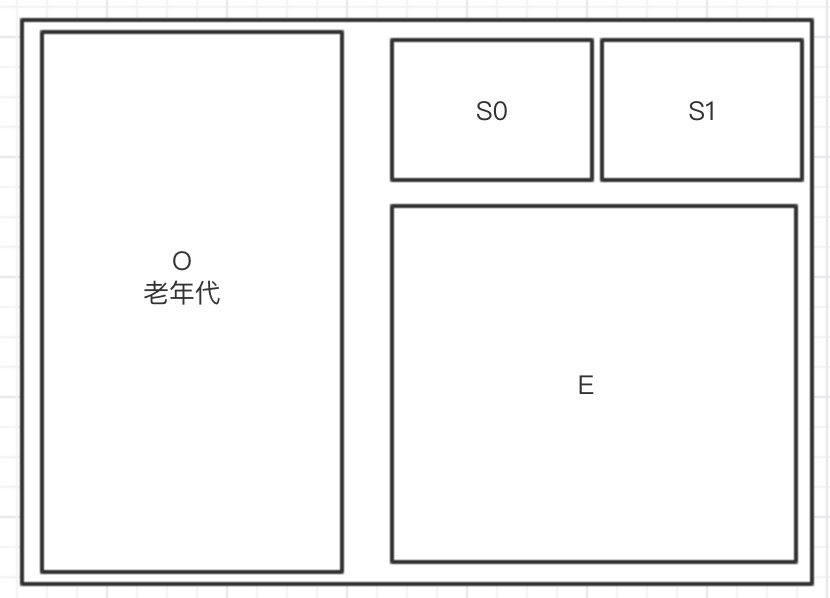

# jvm内存模型（jdk8)
jvm内存模型主要分为5个部分，`程序计数器`、`本地方法区`是两个程序员不用在意的区域，`堆`是new对象保存的内存区，`栈`是方法运行变量暂存区运行完会释放掉，`方法区`在jdk7及以前有一种叫永久带的实现，jdk8被元数据区替代了，其主要存储类元数据信息如类加载器，不过元数据信息的大小不受jvm参数限制了，而是直接使用计算机的内存。

这几个内存区里最影响性能的就是gc所在的堆区，因为栈是自动释放内存的，而堆区内存无法自动释放，只能通过jvm的gc来回收。堆区的内存又可以分为两部分：年轻带和永久带，年轻带一般有两类区域S区和E区，老年前我们一般叫他O区。

堆内存的三个主要区域图：


# 1 启动参数调整堆
调整堆大小的参数，下面为设置启动时申请的堆内存为10m，最大为20m，年轻带大小为3m
```
-Xms10m -Xmx20m -Xmn3m
```
默认的E区和s0，s1区大小比是8:1:1，但是实际上的大小可能会因为垃圾收集器的不同而变化，用CMS收集器（-XX:+UseConcMarkSweepGC）则比例是这个比例，如果是其他的一些收集器，可能会动态的控制收集时间，而调内存区的大小。
# 2

