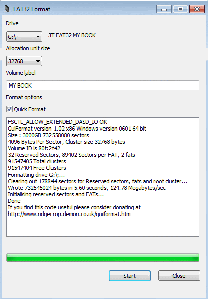
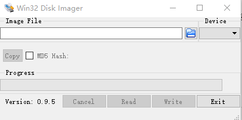

# 树莓派上手教程
## 1 树莓派简介
树莓派就是一个小电脑，cpu是arm构架，内存1G，带了usb和网口，可以直接插。除了电脑有的，树莓派还有开发板子才有的GPIO引脚，摄像头插口等等。
下面我们开始上手吧，需要买的配件大概如下：
- 树莓派3B+裸板
- 大于8G的内存卡和读卡器
- microusb口的充电线(之前安卓常用的线)

刚开始需要有但之后就不需要的
- HDMI线和支持HDMI的显示器一个（我宿舍有显示器所以就用了）

可以有，也可以没有的
- USB鼠标+键盘
- 散热片

上面这几个可能不是必须的，因为我们可以用自己的电脑ssh到树莓派上完成所有操作。但是ssh需要联网，联网配置过程中如果有鼠标键盘和显示器会非常简单。

## 2 入手Pi
我也是第一次购买树莓派（下面简称pi），就从淘宝上搜了一下，发现最新的是3B+版本，就买了一个裸板。长这个样子↓


上面是usb和网口，左边一栏有40个GPIO引脚，右边有耳机口，HDMI口电源口，上面是CPU电容，摄像头插口等组件。
## 3 安装系统
因为买的裸板，所以连内存卡都不带的，需要自己购买>8G的`内存卡`，这里我买的是个闪迪64G的内存卡和ssk的读卡器。


安装系统：

第一步，内存卡格式化为`FAT32`，这里如果遇到格式化的时候没有FAT32这个格式，可能是内存卡容量太大导致，需要下载一个工具[下载链接](http://www.ridgecrop.demon.co.uk/guiformat.exe)将内存卡格式化



第二步，下载做“系统盘”的工具Win32DiskImager[下载链接](http://7ktr6y.com5.z0.glb.qiniucdn.com/Win32DiskImager-0.9.5-install.exe)并安装（可能需要管理员身份运行才能安装成功）

第三步，下载树莓派官方系统[下载页面](https://www.raspberrypi.org/downloads/raspbian/)，入门的话，我们一般下载左边的这个带图形化界面的即可。下载完zip文件，解压出来里面是个img格式的文件


第四步，打开第二步中的win32DiskImager，镜像文件选择刚才解压出来的img文件，Device选择我们第一步中刚格式化好的内存卡。然后点击Write按钮写入系统。



第五步，写入完成，将内存卡安全弹出，直接插入树莓派的卡槽，开机就行了。如果家里有HDMI的显示器，可以先插上显示器再开机，开机完成后,就是下面的界面，会有个时区配置，wifi配置，密码配置等。我直接通过图形化界面就完成了。


这里树莓派和自己的电脑要在一个网络下，后面才能用ssh访问到。
## 4 SSH安装
新系统没有带ssh服务，这比较蛋疼。我们通过下面的指令安装启动
```bash
$ sudo apt-get install openssh-server

$ /etc/init.d/ssh start
```
在/etc/rc.local中添加上面第二句，让ssh服务开机自启动。

SSH就安装启动完成了，到此为止，我们就可以拔了HDMI、鼠标、键盘等设备了，以后就不需要他们了。直接在自己电脑通过SSH即可访问到树莓派了。


## 5 NodeJs环境安装
```bash
$ curl -sL https://deb.nodesource.com/setup_8.x | sudo -E bash -
$ sudo apt install nodejs
$ node -v
v8.1.0
```
## 6 NodeRed安装启动
```bash
$ bash <(curl -sL https://raw.githubusercontent.com/node-red/raspbian-deb-package/master/resources/update-nodejs-and-nodered)
$ node-red
```

