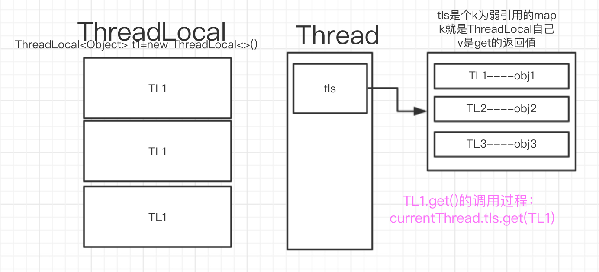

# ThreadLocal
threadlocal是线程内对一个对象的本地化副本，不影响对象本身，也不会线程间互相影响。他的产生的原因是，如果公用一个全局变量，线程间难免会有同步问题。而解决同步问题，势必会降低效率（因为同时只能一个线程在用）。如果不用全局的，而是全都线程本地去声明私有变量，这是完全可以的。其实ThreadLocal不就是要达到这个效果吗。

看过一篇解释为啥要用threadlocal的[文章](https://dzone.com/articles/purpose-threadlocal-java-and)，文中给出了一个非常好的例子，就是servlet处理http请求的时候，需要拿出用户的信息，并且后面很多封装的处理都需要这个用户信息。作为参数在所有函数中传递是比较麻烦的做法。
```java
doGet(HttpServletRequest req, HttpServletResponse resp) {
  User user = getLoggedInUser(req);
  doSomething(user)
  doSomethingElse(user)
  renderResponse(resp,user)
}
```
而threadlocal则轻松应对
```java
doGet(HttpServletRequest req, HttpServletResponse resp) {
  User user = getLoggedInUser(req);
  StaticClass.getThreadLocal().set(user)
  try {
    doSomething()
    doSomethingElse()
    renderResponse(resp)
  }
  finally {
    StaticClass.getThreadLocal().remove()
  }
}
```
这个例子中我们也看到了，threadlocal使用要注意的几个点，1 最好存为静态threadlocal。2 使用完一定要remove。
# 看下原理
```java
public T get() { }
public void set(T value) { }
public void remove() { }
protected T initialValue() { }
```
上面已经看到了threadlocal有get set remove方法，他还有个初始化的方法，相当于初始的set值，默认返回null。为啥能做到每个线程有个单独的一份副本呢，原来数据本身并不是存在threadlocal中而是存在thread对象的一个map类型的字段中，threadlocal只是key。每次执行get set都是从当前线程的tls中去拿。

# 抛出问题
## 1 初始化的时间
每个线程创建的时候都要直接把所有的threadlocal复制一份吗？显然不可能，初始的线程tls字段是null。在get时，先判断tls是null，就创建一个新的map作为tls并且插入一条entry: `thisthreadlocal--initialValue()`。如果上来是set就没有这个问题了。
## 2 弱引用是什么
### 强引用
```java
Object o=new Object();
```
指针o是对新建对象的强引用，即使内存面临溢出OOM错误也不会被清理。
### 软引用
```java
Object obj = "123";
SoftReference<Object> sf = new SoftReference<Object>(obj);
obj=null;//释放强引用
System.out.println(sf.get());
```
这里sf是对象的软引用，只被sf软引，软引用的对象在内存溢出的时候该对象会被清理掉。
### 弱引用
```java
Object obj = new Object();
WeakReference<Object> wf = new WeakReference<Object>(obj);
obj = null;
wf.get();//有时候会返回null
```
弱引用的对象活不过下次gc。
验证程序：
```java
public static void main(String[] args) throws InterruptedException {
        Object obj = new Object();
        WeakReference<Object> wf = new WeakReference<Object>(obj);
        obj = null;
        int jf=0;
        while (wf.get()!=null) {
            System.out.println(jf++);
            for (int i = 0; i < 10000; i++) {
                Thread.sleep(1);
                Integer j = new Integer(i * 100);
            }
        }
        System.out.println(wf.get());//有时候会返回null
    }
```
```
$ java -Xms5m -Xms5m -server -XX:-DoEscapeAnalysis -XX:+PrintGC com.example.test.trantest.proxytest.Main

1
2
3
[GC (Allocation Failure)  1023K->424K(5632K), 0.0010727 secs]
null
false
```
### 虚引用
幽灵引用,get永远都是null，没啥意义，唯一的作用就是强制指定要回收的对象。
```java
Object obj = new Object();
PhantomReference<Object> pf = new PhantomReference<Object>(obj);
obj=null;
pf.get();//永远返回null
```
## 3 为啥ThreadLocalMap.Entry继承弱引用
Entry extends WeakReference<ThreadLocal<?>>这里其实是指的这个entry对他的key弱引，即如果key不再被其他地方引用的话，该key(threadlocal)会被gc。被gc掉之后这里的key就变成null了，value部分就失去意义了，如果不清楚就内存泄漏了，所以threadlocal有个清理无效entry的设定。

既然可能造成内存泄漏，那为什么还要这么做呢？其实下面会讲到调用get set和remove方法中任意个，都会清除掉如果key为null的value。即在谨慎使用时，不会内存泄漏，而弱引用，可以及时尽早的的清理不用的threadlocal和对应的value。

【很多时候我们把threadlocal声明为static所以不被清理，因为threadlocal其实不存数据，只是个标志，所以放在静态区也是可以应对内存泄漏的，上述泄漏都是特定场景下的】。

## 4 清理无效value
上面说在set get 和remove的时候，会清理null作为key的entry。具体咋实现的呢？

参考[code/ThreadLocal.md](code/ThreadLocal.md)