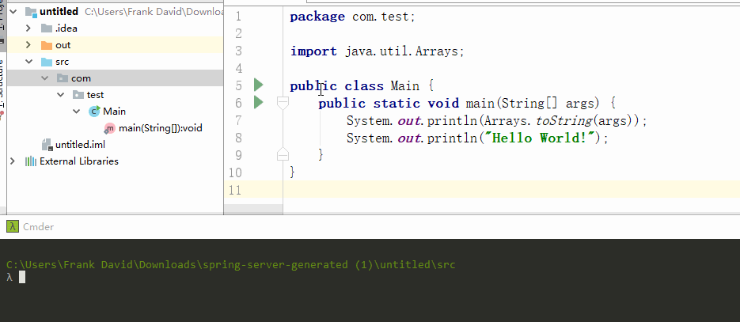
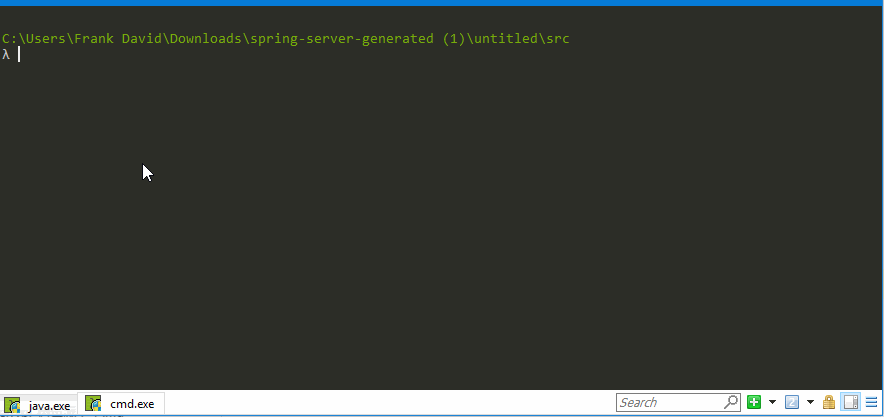
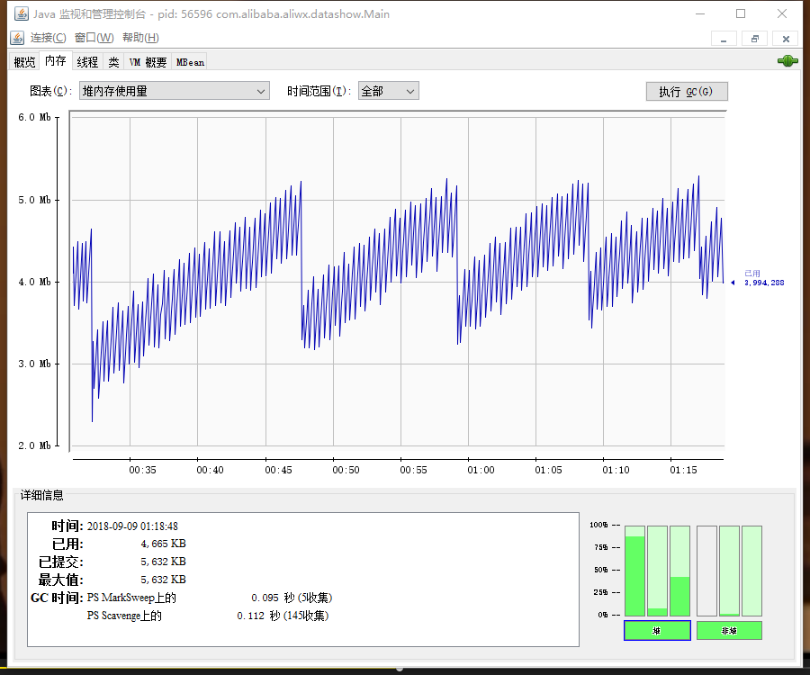

# jvm调优与问题查找
导读：本文介绍基本的jvm分析工具，基本都是jvm自带的。有jps jmap jstat jstack jconsole等，当程序出现问题如内存彪满，cpu彪满等情况的时候可以拿这些指令的组合来分析。
# 0 java基本指令
开始之前复习下基本指令`javac` `java`和`jar`

# 1 jps查看java进程
常用指令
```bash
# l是列出全类名或jar包名,m是列出输入到main的参数
jps -lm
```
例如我们把上面0中的程序改为每秒打印一次helloWorld，使程序一直运行。然后看一下jps的输出：

# 2 jconsole图形化监控
jvm自带的图形化监控java进程的工具。监控内存、线程等状况。这里插一句线程的六种状态，`NEW` `RUNNABLE`、`BLOCKED`、`WAITING`、`TIMED_WAITING`、`TERMINATED`。可见源码和注释[连接](code/Thread.state.java)。

jconsole可以监控堆内存ESO区的内存使用量，以及堆外内存占用。也可以查看线程所处的状态堆栈跟踪等。如下：  

上图中显示了E区满后的一次minorGC的过程。

运行一段时间后的内存折线图,小的波谷是ygc大的是fgc下面也有显示次数，另外也显示了gc的收集器是PS和PO，其他收集器设置方式和特点可见jvm内存模型这篇日志。  

# 3 jstat查看内存
jconsole在远程机器上没法运行，所以在服务器上没啥用。jstat用指令查看内存占用。最常用的指令是
```bash
jstat -gcutil pid [interval{ms}]
# 例如：
# jstat -gcutil pid 500 就是每500ms打印一次内存占用信息和gc次数时间信息
```
查看各个区内存的占用情况返回内容格式如下，都是百分比和次数，S0S1EO就不用解释了，M是元空间，CCS压缩类空间，YGC FGC是显示的次数，带T的是平均耗时。
```
  S0     S1     E      O      M     CCS    YGC     YGCT    FGC    FGCT     GCT
  0.00  25.00  85.71  64.72  93.59  87.83     29    0.027     1    0.022    0.049
```
其他较常用指令
```bash
# 类似gcutil不过是显示具体值，而非百分比
jstat -gc pid
# 类似gc只显示新生/老年代部分的
jstat -gcnew pid
jstat -gcold pid
```
更多指令参考[这篇文章](https://www.cnblogs.com/lizhonghua34/p/7307139.html)
# 4 jstack分析线程
jstack命令主要用来查看Java线程的调用堆栈的，可以用来分析线程问题（如死锁）。
使用方式
```bash
# 无参等价于-l，一般也就只用这个无参就行了
jstack [-l -m] pid
```
jconsole中线程部分的监控中也有相关信息，和这里的是一模一样的。所以有图形界面的话jconsole是比较好用的。
# 5 jmap生成内存dump文件
相当于内存的截图文件，但是如果程序因为OOM直接崩溃就无法还原现场了，这种一般用`-XX:+HeapDumpOnOutOfMemoryError`参数设置OOM时自动保存截图。
```
jmap -dump:file=<filename> pid
```
除了截图功能jmap其实也可以打印内存信息用，这俩指令算是用的最多的了
```
# 打印堆信息，概述性的比jstat要显示人性化
jmap -heap pid
```
更多内容可以[参考](https://www.cnblogs.com/myna/p/7573843.html)。
# 6 visaul VM
类似jconsole的图形化分析工具，但是功能更多，可以把dump文件导入进行分析。一次本地内存分析过程，源码：
```java
public class Main {
    public static void main(String[] args) throws Exception {
        List<Long> list = new LinkedList<>();
        while (true){
            Thread.sleep(100);
            list.add(1000L);
        }
    }
}
```
  
将上面源码中sleep删掉，后调小堆的大小，使得程序很快OOM。（记得设置-XX:+HeapDumpOnOutOfMemoryError）


分析dump文件发现占用内存最多的是LinkedList中的Node对象，Node对象中存的是Long对象。