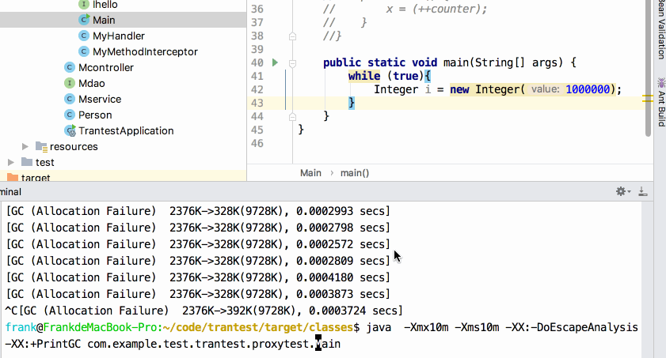

# jvm内存模型（jdk8)
jvm内存模型主要分为5个部分，`程序计数器`、`本地方法区`是两个程序员不用在意的区域，`堆`是new对象保存的内存区，`栈`是方法运行变量暂存区运行完会释放掉，`方法区`在jdk7及以前有一种叫永久带的实现，jdk8被元数据区替代了，其主要存储类元数据信息如类加载器，不过元数据信息的大小不受jvm参数限制了，而是直接使用计算机的内存。


这几个内存区里最影响性能的就是gc所在的堆区，因为栈是自动释放内存的，而堆区内存无法自动释放，只能通过jvm的gc来回收。堆区的内存又可以分为两部分：年轻带和永久带，年轻带一般有两类区域S区和E区，老年带我们一般叫他O区。


# 1 启动参数调整
调整堆大小的参数，下面为设置启动时申请的堆内存为10m，最大为20m，年轻带大小为3m，每个线程分配栈大小为1m（栈大小其实可以是很小因为只存指针和基本数据类型）
```
-Xms10m -Xmx20m -Xmn3m -Xss1m
```
默认的E区和s0，s1区大小比是8:1:1，但是实际上的大小可能会因为垃圾收集器的不同而变化，用CMS收集器（-XX:+UseConcMarkSweepGC）则比例是这个比例，如果是其他的一些收集器，可能会动态的控制收集时间，而调内存区的大小。
# 2 栈的主要用途
栈、程序计数器和本地方法栈三者是`线程私有`的，每个线程栈的大小可以通过Xss进行设定，上面提到了。栈主要用于存储8大基础类型（boolen,char,byte,short,int,long,float,double这部分又叫局部变量表)以及对象指针，返回地址，另外栈在执行函数的时候会开辟`栈帧`来进行函数内部的上述内容存储，当然也是要存调用的函数的返回值的（即使没有变量来接收这个返回值）。函数中new的对象一般放在堆上,也有栈上的时候后面会说.  下图枣红色是堆，大红色是栈。

# 2.1 栈中存对象的情况（逃逸分析）
逃逸是指在函数运行的时候，对象被外部引用或者对象作为返回值。逃逸分析是在编译的时候做的，从jdk6开始已经默认开启。比如这样一段代码
```java
public static void main(String[] args) {
    while (true){
        Integer i = new Integer(1000000);
    }
}
```
注意int值一定要是大于127的。  
在while的作用域内，进行逃逸分析，发现i对象并没有逃逸。而且对象大小较小，可以分配到栈上，此时i就会被分配到栈上。我们指定一个较小的堆大小，对这段代码分别开启和关闭逃逸分析进行运行，看下效果
```
//设定堆大小10m 打印gc信息
-Xmx10m -Xms10m  -XX:+PrintGC
//关闭逃逸分析
-XX:-DoEscapeAnalysis
```
关闭逃逸分析后，因为都在堆上new对象，所以堆炸了，疯狂gc  

而不关闭逃逸分析后，因为在栈上new对象，栈每次用完自动弹出内存，所以gc大大减少(这里+DoEscapeAnalysis参数其实就是jdk默认的参数)  

# 3 常驻对象
先引出一个问题，下面代码中为啥前三个打印true。后俩是false。
```java
public static void main(String[] args) {
    f(1,1);         //true
    f(-128,-128);   //true
    f(127,127);     //true
    f(128,128);     //false
    f(1000,1000);   //false
}
public static void f(int a,int b){
    Integer x=a;
    Integer y=b;
    System.out.println(x==y);
}
```
我们知道在比较对象的时候都是用的equals方法比较，而不是用==，因为后者比较的是内存的地址。这里前三个返回true说明两个对象确实是同一个。这是咋回事呢？

原来，java对基本数据类型的封包类型进行了提前的对象创建，比如`Integer`类型[-128,127]这256个对象都提前在堆上进行了创建，之后程序无论什么地方去new这个范围内的Integer对象，都会直接将创建好的对象的地址返回过去。于是乎，无论在哪new的Integer(1)都是同一个对象。这样做最大的好处就是这些常用数字对象都可以直接从内存拿来复用。

除了Integer对象缓存了256个，Boolean2个全部缓存，Byte[-128,127]全部缓存，Short[-128,127]缓存了256个，Long[-128,127]缓存了256个，Character[0,127]缓存了128个注意char没有负值，Float和Double没有缓存。
# 4 GC
堆内存中的没用对象，需要被回收。这就是GC（垃圾回收）。什么情况下需要对对象进行回收呢？通俗讲就是没用的对象，那怎么判断有没有用呢？Jvm中规定了GCroot对象可达的对象都是有用的，否则都是没用的。GCroot一般有四种：
- 1 栈上引用的对象
- 2 方法区静态属性引用的对象
- 3 方法区常量引用的对象
- 4 本地方法栈上引用的对象
## 4.1 常见三种GC算法
- 标记-清除：遍历-对要清理的打标记-再次遍历清除掉标记者
- 标记-整理：为了减少内存碎片。标记完进行清除的时候，把后面的内存往前移动，把空缺填上
- 复制：针对年轻带的一种算法E区两个S区，对象只能在E上创建，然后在满的时候把From和E区的有用的对象复制到To区，然后to from互换。
## 4.2 对象在堆上各区如何移动
之前图已经看出堆分E S和O三个区，大小比应该是E:S0:S1=8:1:1,这个是默认比。然后O区的大小应该是O:E+S0+S1=3:1默认。由于对象的朝生夕死特性，即对象一般存活周期很短的特性，所以E区较大，而S区只有其八分之一。而从E到S(to)是需要对象在本次GC的时候能活下来，就可以转到S区。

每次`年轻带GC(MinorGC)`都会导致四件事：
- 1 E和from中该死的对象都被回收
- 2 不该死的都复制到了to，对象age+1
- 3 复制完，E和from被清空
- 4 from、to互换角色

每次gc存活下来的对象年龄都+1，当到达6岁时，认为对象'老了'。直接扔到O区，而非to区。

如果是个大对象、数组等，会直接扔到O区。

几个调整内存区比例的参数
```
-XX:NewSize=n:设置年轻代大小
-XX:NewRatio=n:设置年轻代和年老代的比值。如:为3，表示年轻代与年老代比值为1：3
-XX:SurvivorRatio=n:年轻代中Eden区与两个Survivor区的比值。注意Survivor区有两个。如：8为默认值
```
## 4.3 垃圾收集器
我们知道了垃圾为啥需要回收（没有的对象，内存回收）、回收的算法、具体在内存什么区域进行回收。再来看看垃圾收集器和分别用的算法。【年轻带全都是复制算法主要看老年代是清理还是整理】

### 1 Serial【年轻带】
串行收集，稳定高效，单线程，停顿长。复制算法
### 2 Serial Old【老年代】
老年代版本的串行收集。`标记整理`算法。新老带都使用串行收集，是一种常见的收集器组合，多用于client端，指定方式为`-XX:+UseSerialGC` 。
### 3 CMS【老年代】
CMS收集器特点是最短的停顿时间，MS即标记清理，并发服务提供者一般用CMS，指定方式为`-XX:+UseConcMarkSweepGC`，指定CMS作为老年带收集器后，默认用`ParNew`作为年轻带收集器。
### 4 ParNew【年轻带】
Serial的多线程版本，`-XX:+UseParNewGC`指定ParNew为年轻带收集器，后默认用`Serial Old`作为老年代收集器(不过马上要废弃了)。看来三者有三角恋。

ParNew+CMS的组合是服务端常用的
--
### 5 Parallel Scavenge【年轻带】
和ParNew类似，不过PS注重时间比，即他会动态调整ESO三个区的大小，来保证每次gc时间占程序运行时间的比例一定。`-XX:+UseParallelGC`
### 6 Parallel Old【老年代】
老年版本的PS，用法为`-XX:+UseParallelOldGC`，又叫PS Mark Sweep，也是标记清理。

PS+PS Mark Sweep组合是不指定参数的时候使用的收集器
--
### 7 G1 【年轻+老年】
一种新的思路，打散了内存，成片。具体可自己查，是一种新一代的收集器。

## 4.4 FROM区能否new对象？
一般不可以。但少数情况下：在full gc后还没啥空闲空间的情况下，之后的一个周期也能在from space分配给new的对象用（改了个标志位）。标志位只在fullgc后才能被clear，也就意味着在下次fullgc之前from space都能分配，（也可能下下次）。

