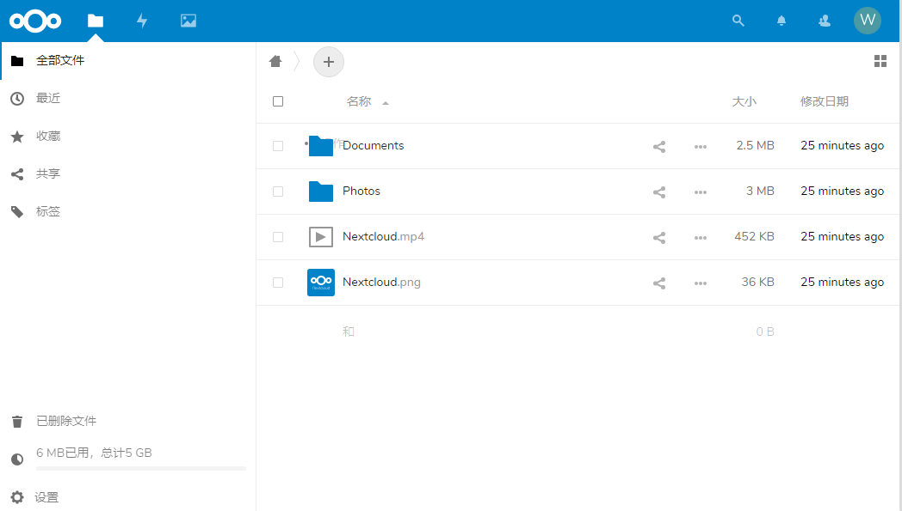
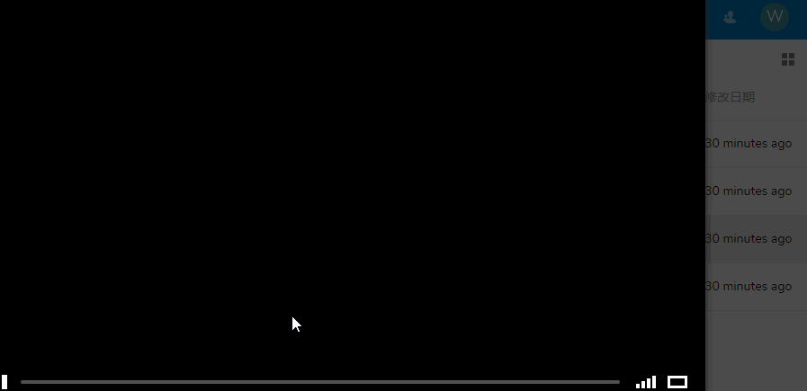

# nextcloud
nextcloud就是开源版的onedrive。可以实现网盘存储文件、和本地目录保持同步。
# 1 安装与使用
**首先安装server端**，官网提供了server端的多种下载方式，源码是基于php的，然后由于文件系统的一些限制，服务端不能运行在windows上。我们使用docker安装
```
docker run -d -p 80:80 nextcloud
```
然后直接通过网页访问即可，第一次访问会让创建管理员账号。创建完我们进去界面上有一些默认的文件。界面如下  
  

**然后安装客户端**，先安装下windows版的客户端，直接官网下载安装，设置服务器地址和账号密码，以及本地的同步目录。然后就和onedrive的功能一模一样了。  
   
 
## 1.1 文件直接查看和共享连接
  

## 1.2 直接拖拽上传文件
  

# 2 小结
nextcloud基本上就是onedrive的开源版，onedrive可以在线编辑word等功能是n没有的。不过把文件的云端存储功能已经做得还算不错了。况且onedrive免费空间只有5g，next则可以无限空间（取决于server设置）。

next的应用场景应该是对于私网的环境下的文件共享，文件存储等。