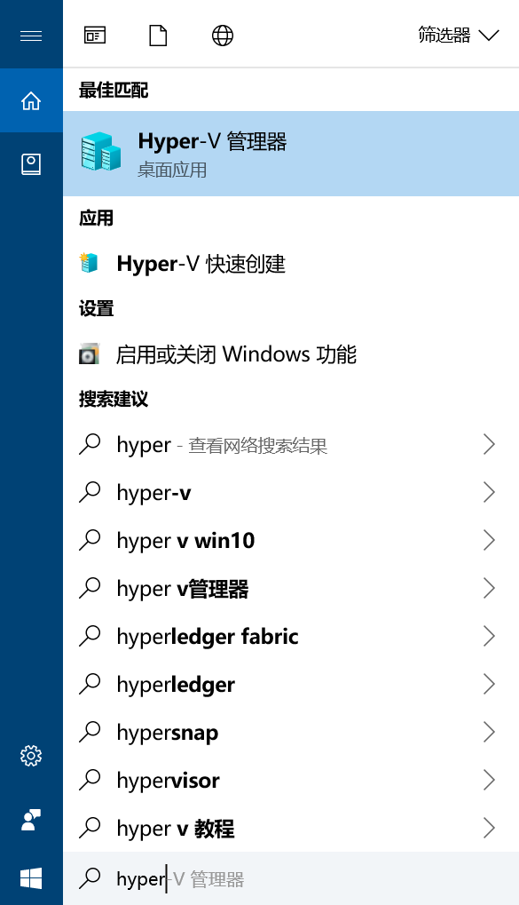
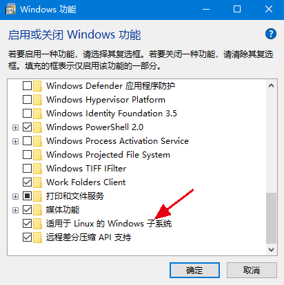
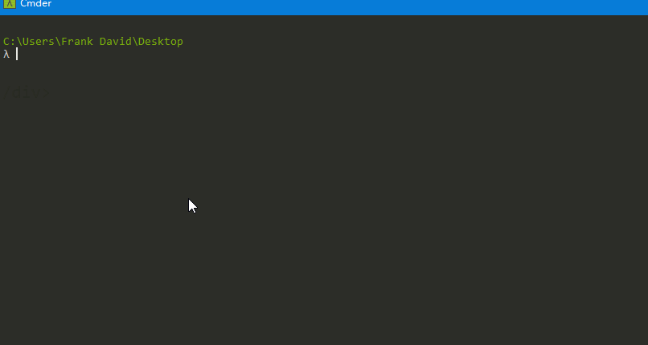
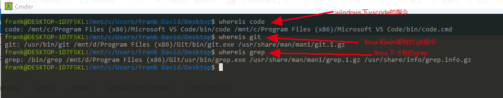

# win10下的开发利器
# 1 Docker for win10
## 1.1 hyper-v
win10下的docker基于hyper-v技术，所以先来说下这个是啥。hyper-v其实是微软的一项虚拟化技术，并且在windows专业、教育和企业版上才有该功能，如果你的电脑是家庭版，就无法安装了，如果不想升级系统，可以尝试后面的子系统。

开启hyper-v，在启用和关闭windows功能窗口，勾选hyper-v，确定，重启电脑后即可开启。  
  
重启后等待几分钟（让windows建立好程序索引），在开始菜单输入hyper-v即可看到一个管理器。
  
这个管理器是啥呢？他其实功能和VMware一模一样，是一个虚拟机的管理器。通俗讲hyper-v就是windows自带的VMware。所以我们学习linux，并不需要安装第三方的虚拟机，windows自己就带了。通过点击右上的新建-->虚拟机-....->选择系统iso镜像，就可以创建虚拟机了。之后可以用图形化界面访问也可以用ssh登录。  
  

## 1.2 docker
docker容器这里不多介绍了，可以自行了解下，是近些年非常火热的技术，几乎所有的公司都在用。docker设计之初只能在linux上运行，后来逐渐增加了对mac和win的支持。直接在[官网](https://www.docker.com/products/docker-desktop)（注册登录）就可以下载exe安装文件。

安装完成，运行后，右下角有docker的图标。此时的cmd中就可以使用docker指令了。例如新建一个nginx服务的指令如下  
  

# 2 Subsystem子系统
win10有子系统的功能，这个子系统区别于前面的虚拟化技术。占用的资源更少，安装更容易，使用更简单，也更容易让初级开发者接受。
## 2.1 安装
开启子系统功能，如下（开启后可能要重启一下）：  
  
然后到微软store下载ubuntu
  
在开始菜单就会有个ubuntu的应用，单机后即可开始安装
  
几分钟后，会让输入用户名密码，然后就安装完成了  
  
查看后发现这个ubuntu是18.04 64位版本的。
## 2.2 使用
上面安装完，已经进入了熟悉的shell模式。但是我想可能有人会觉得我需要打开ubuntu这个应用，才会帮我开启这个系统，类似虚拟机。`其实不是`。

子系统是伴随windows就会启动的，当安装完成后，不需要打开ubuntu这个应用，ubuntu系统就已经在运行了。这一点很神奇。我们可以在任意目录下打开cmd输入bash，就会切换到ubuntu系统。  
  
上图中我们也看出，这个ubuntu系统已经将整个windows的文件系统挂在到`/mnt`目录下了，这对于两个系统下切换开发是非常方便的。

而且很牛叉的是，在这个bash下，支持windows和linux两边的环境变量  
  

