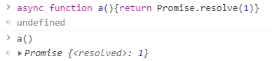
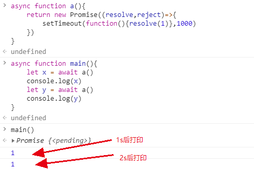

# await作用范围
await/async是es6新的异步的写法。其中async用于修饰内部含有异步操作的函数，await只能用在async的函数内部，用于等待另一个异步操作的结束。

## 1 先来讲下async
async修饰的函数的返回值默认是个Promise，即使没写return也是Promise，只不过是resolve和reject没有定义的Promise。  

自己写一个Promise作为return的值  
  

然后尝试延时返回来模拟异步  

## 2 await的用法
await用在Promise前面，因为async返回值就是Promise，所以我们用上面的例子作为await的衔接对象即可。另外await必须用在async函数中，所以我们新构造一个main函数如下  
  
await会等待Promise执行(resolve)完毕，所以1s打印1，再1s又打印个1。
## 3 存在的疑问
我困惑的地方是js是单线程的，以nodejs来讲，如果一个web服务有俩接口，分别是查询数据库的操作。如果一个接口使用await是否会阻塞另一个接口的访问呢？

存在这个疑问的主要原因是通常的数据库查询是回调函数，如果换成await这个词本身就是等待的意思，会不会因为一个接口的等待，阻塞整个服务呢？另外从上面我们也看出了await在同一个函数上下文是会阻塞后面的操作的。

验证：  
  
原来不同函数中的await是不会互相阻塞的，其实await是回调嵌套的语法糖，实质上和回调函数的操作是一样的，所以不存在我们担心的情况啦。
