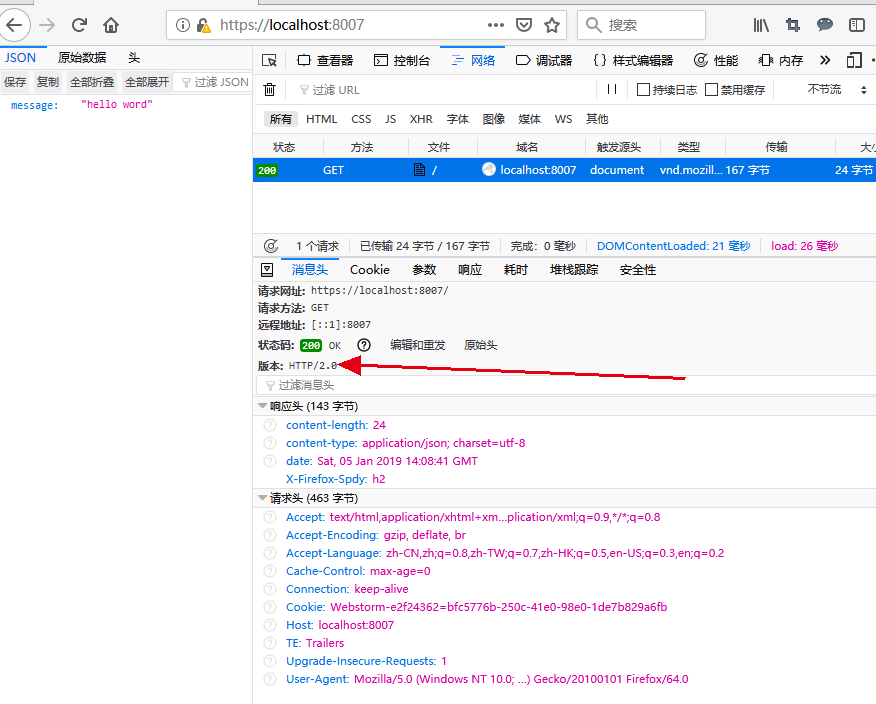

# http 2.0
http2.0规范在15年的时候就已经提出了。不过19年已经到来了，2.0的规范似乎还是没有推广开来。是因为不好用吗？其实并不是，主要是http1.1的应用太多、而且大部分时候性能也是满足需求的，所以很多服务没有必要更换为2.0。
# 从http1.0讲起
http1.0自然是最早版本的协议，它规定了浏览器与服务端进行交互时可以建立一个tcp连接，在这个连接里，浏览器把请求发到服务器，服务器把响应返回给浏览器。处理完成后需要立即断开。

例如我们访问一个页面由一个html，一个js和一个css构成，那在http1.0协议下，就需要与服务器连接拿到html，然后断开。接下来同样的过程拿到js和css。显然我们看到了这个过程中存在一个智障的设计就是tcp连接不能复用，导致分别与服务器连接了三次。
# 改进后的http1.1
http1.1是对http1.0的改进。

- 添加了host请求头，这对代理是很有用的，可以[参考](18.6/utils_nginx.md)中的nginx利用host进行代理。
- 添加了Connection请求头，有keep-alive和close两种设置，申请本次请求之后不立即断开于服务端连接，实现连接复用[注意申请不一定会被服务端批准]。
- 添加了身份认证、Cache机制等等

可见1.1最主要的是解决了连接复用的问题，还有其他的细节就不那么重要了。但是其实1.x协议还存在一些整体的设计问题。
# http 1.x的设计
客户端/浏览器发起请求，请求的方式有`get/post/delete/put/patch/header`等，请求本身由`header`和`body`组成，这也是我们使用postman需要设置的一些参数。参数的传递主要有`路径参数`、`查询字符串`、`请求体`等方式，一般而言get delete方法倾向于用前两种方式传递参数，而post put等方法倾向于请求体传参。请求体传参可以传递的文字内容更长，且更安全，请求体文字的格式也有很多种，最常见的就是form表单和json格式，需要用Header中的Content-Type字段声明请求本身是以什么格式传递参数。

请求头在http1.x中有很重要的作用，列举几个以上没讲到的重要的请求头参数，Cookie用于记录一段专属于当前域名的信息，accept指定接收的相应的格式，authorization用于身份认证信息有base和bearer两种，之后的文章会展开讲一下。

服务端接收到请求，并可以解析请求的上述所有内容。例如可以将参数解析出来，然后进行相关的后台逻辑处理，最后返回一个响应。响应本身也是由`header`和`body`组成，header中也会有Content-Type来表明本次响应的数据格式是什么。body则是存放返回的数据。  


在http1.x中存在几个问题：
- 1 cookie每次都要传输，上面讲了cookie是针对域名存在浏览器中的信息，在每次访问这个域名的任何资源的时候，都会携带，然而其实只有少数资源是需要这个cookie的。cookie代表的这一类问题是**首部的冗余**。
- 2 keep-alive允许一个连接可以存活一段时间，用于后续的其他资源的请求时使用。但是如果所有资源都在一个域名下，而都使用一个tcp连接的话，就必须串行的挨个下载每个资源，这就比较慢。这个问题就是**文件串行加载问题**。ps:浏览器有并发的设置，同一个域名下也可以有多个连接，注意了连接越多，连接利用率越低(1.0的弊端)，连接越少，资源加载串行，如果资源太多就会明显加载变慢。所以连接数需要限制在一个合适的范围内，不同浏览器并发数的限制如下表。
  
所以现在你知道为什么会需要设置通过cdn访问一些资源了吧，所以你现在也知道为啥我们在F12看网络加载的时候会有瀑布流了吧。

- 3 http1.x是基于请求响应的交互模式，没有请求就没有响应，服务端不能主动向前端发送通知，websocket一定程度上缓解了这个问题。

# http2.0
为了解决上面的首部冗余，2.0中使用了`首部压缩`，这里我不展开讲了，因为我也不太懂，可以[参考](https://blog.csdn.net/tq08g2z/article/details/77311579)。

而为了解决`串行加载`问题。HTTP2.0使用了多路复用技术，传输的内容不再是字符，而是`帧`。字符的问题在于需要有严格的先后循序，而帧中记录着自己的位置指针，所以可以瞎几把乱传，然后最后拼图一样拼起来就行，这样就不会有阻塞问题（串行问题）。另外就是同一域名资源是在一个流上传输的，想象一下一个服务器上请求的多个文件，被打散成无数块“拼图帧”扔到流上，到客户端被逐渐的拼接成本来的模样。

为了解决服务端主动发消息问题，加入了push这个api，之后会演示下这玩意咋用。
# 用gin提供http2.0服务
go1.8版本之后，就支持http2.0了，而且不需要额外的配置，只要添加ssl证书的https server本身就支持http2.0。这里我使用了一个高性能的web框架gin。

先生成证书：
```shell
$ openssl genrsa -out ./server.key 2048
$ openssl req -new -x509 -key ./server.key -out ./server.pem -days 365
```

然后代码如下
```go
package main

import (
	"github.com/gin-gonic/gin"
)

func main() {
	r := gin.Default()
	r.GET("/", func(c *gin.Context) {
		c.JSON(200, gin.H{
			"message": "hello word",
		})
	})
	r.RunTLS(":8007", "./server.pem", "./server.key")
}
```


