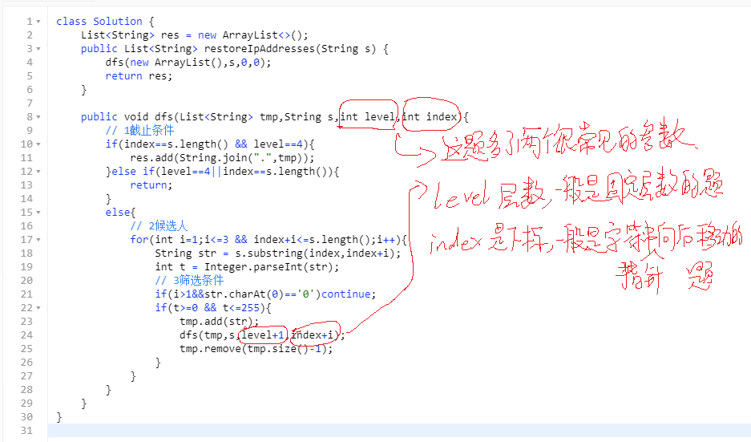
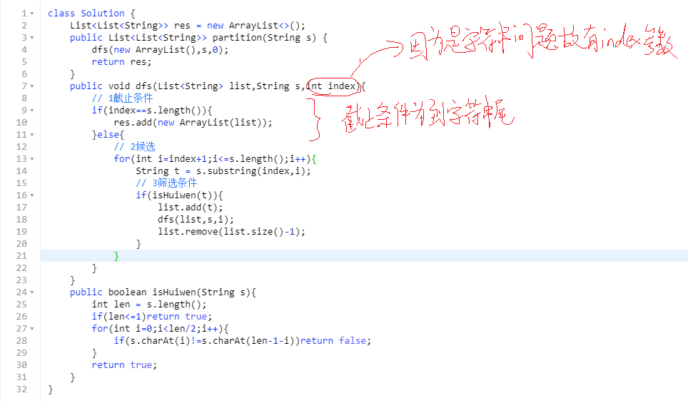

# DFS
dfs是非常重要的算法解决方式，常用于解决有多次选择，每次都依赖于上一次的选择而有限定的问题。并且一般是需要你列出所有的可能性。

例如排列组合问题，给n个值，求出所有排列可能性，求出所有组合的可能性。

这就是非常经典的dfs。一般的思路是，先用一个数组记录每个元素的个数。然后为第一个位置选择元素，有n种选择，然后每种里面需要为第二个位置选择元素，此时有n-1种选择，因为记录元素个数的那个里面第一个元素对应的个数少了1。依次类推就有n!个排列方式。
```js
function f(arr){
    var count={}
    for(var i=0;i<arr.length;i++){
        count[arr[i]]=count[arr[i]]?count[arr[i]]+1:1
    }
    var len =arr.length;
    // 记录数组中所有元素 用两个数组 一个记录元素，一个记录个数
    var ele = Object.keys(count)
    var cos = Object.values(count)
    var res=[]
    console.log(ele,cos,res)
    dfs([],res,ele,cos,0,len)
    return res
}
function dfs(list,res,ele,cos,index,len){
    if(index==len){
        res.push(Object.assign([],list))//注意深拷贝
    }else{
        for(var i=0;i<ele.length;i++){
            if(cos[i]>0){
                list.push(ele[i])
                cos[i]--;
                dfs(list,res,ele,cos,index+1,len)
                list.pop();
                cos[i]++;
            }   
        }
    }
}
/*

我们再来看组合的dfs，组合和排列不同的在于

1 组合不需要选出所有元素，可能是k个(k小于总个数)所以代码的截止条件换为`index==len`中参数len换成k。

2 不同顺序的排列是同一种组合如1,2和2,1是同一种，所以可以按照从小到大的顺序筛选，即index是i的数字，一定大于i-1。所以代码的筛选条件添加一条`if(list.length>0&&ele[i]<list[list.length-1])continue;`
*/
```
# 能否抽象成选择问题是判断是否能用DFS的关键
DFS是对多叉树的遍历，每一层其实都是代表一个选择。如排列问题，可以抽象成每个坑位的选择。再比如IP问题，是每个IP段的选择。
# DFS代码三个基本点
只要找到了这三个基本点，代码写起来就简单了。
- 1 `截止条件`，dfs函数执行结束的条件，分为两种一种是到了选择数上线或者最后一个元素了则return；另一种是满足了题目要收集的数据格式，则直接把当前值加到结果数组中。
- 2 `候选人`，指下一个选择中可以作为候选的元素有哪些。没有特别的就是所有元素。
- 3 `条件筛选`，根据题目的不同，需要对候选人进行一定的筛选，例如用过的元素不能用，满足回文等等之类的。
# 经典题目
**1 数组中，列出任意多元素和为target的可能。例如[1,2,3,5]target=6有111111,222,33,123,15这些可能**  

除了图上注意的点，这里还要强调两点，一个是dfs的参数，一般有一个记录中间结果的list是必须的，有些参数是一直不变的，如这里的原始数组。另外有时候会有level参数，表示现在是第几层，这里不需要层数，因为不限制数的个数。

**2 同第一题，只不过数组中可能有重复数字且数组中每个数字最多用一次**  


**3 IP字符串种类，如25525511135有两种255.255.11.135和255.255.111.35**  


**4 字符串s，切割后每一段必须是回文，求切割方式 例如aab，切割方式有[aa,b],[a,a,b]**  
