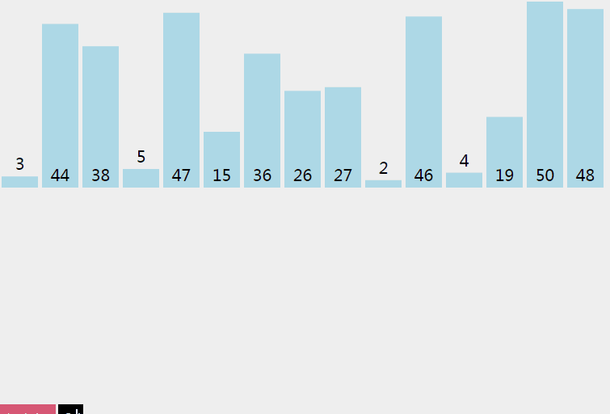

# 排序问题
在之前的[文章](../18.2/utils_排序.md)中已经介绍了排序算法。这里更进一步深入探讨下排序问题。
# n*n的排序
冒泡、插入和选择，三种是常见的n2排序算法。

插入是较好理解的，他是稳定的并不改变元素的相对位置，最好情况下只需要和前一个元素比较一下，因而是O(n)，最差和平均都是O(n2)。

冒泡排序，也是稳定的，他不改变相同元素的相对位置，未改进的冒泡最好情况也是O(n2)，但是添加了交换标志位后，算法最好情况就优化到O(n)，[参考](https://blog.csdn.net/jianjimmy/article/details/80566475)，最差和平均是O(n2)

选择排序，是不稳定的，例如5,5,2=>2,5,5。此时最后一个5是和2交换来的，这时两个5已经换了顺序，因而不稳定。选择排序因为不可避免的进行比较所以最好最坏和平均都是O(n2)
# 归并排序
  
归并排序，在编程题目中遇到的是将两个有序链表合成一个有序链表,就是归并排序的最后一步。

归并排序如图所示，流程非常清楚，在排序过程中，需要同等数组大小的空间来存储结果，所以空间复杂度不像之前的1,这里是O(n)空间，最佳最差和平均时间复杂度是O(nlogn)。

对于稳定性，归并是稳定的，因为两个相同的值，在排序过程中不可能发生前后调换。
# 快速排序
快排也是典型的分而治之的思想，代码如下。分区函数思路是将hi作为pivot，然后从头比较，将小于pivot的放到a++,大于的放到b--
```js
function partition(a,lo,hi){
	var pivot = a[hi];
	var j = hi-1;
	for(var i=lo;i<=j;i++){
		if(a[i]>=pivot){
        	swap(a,i,j);
			i--;
			j--;
		}
    }
    if(a[i]>=a[hi]){
        swap(a,hi,i);
    }
    return i;
    //返回分界，pivot的位置
}
function swap(a,i,j){
    var t= a[i];
    a[i]=a[j];
    a[j]=t;
}
function sort(a,lo,hi){
    if(lo>=hi)return;
    var p = partition(a,lo,hi);
    sort(a,lo,p-1);
    sort(a,p+1,hi);   
}

var a= [5, 6, 3, 2, 6, 7, 8, 1, 9, 4]
sort(a,0,a.length-1)

```
快排衍生的题目也很多，尤其是partition函数。比如将链表大于t的和小于t的分成两步分（两个链表），数组i位置存放i本身的众多题目等。

快排的平均和最好是O(nlogn)最差是O(n2)即每次取pivot分割的一块都是只有pivot本身，等于在做选择排序。空间复杂度是O(logn)因为用了函数递归栈，调用了logn次。
# 堆排序
```js
function heapify(a,n,i){
	var left = 2*i+1;
	var right = 2*i+2;
	var max = i;
	if(left<n && a[left]>a[max])max=left;
	if(right<n && a[right]>a[max])max = right;
	if(max!=i){
		swap(a,i,max)
		heapify(a,n,max)
    }
}
function swap(a,i,j){var t = a[i];a[i]=a[j];a[j]=t;}
function sort(a){
	for(var i=a.length/2-1;i>=0;i--)
		heapify(a,a.length,i);

	for(var j=a.length-1;j>=0;j--){
		swap(a,0,j);
		heapify(a,j,0)
    }
}
```
堆排序主要是利用大顶堆进行的排序。原理性的东西可以从[这里](https://www.cnblogs.com/0zcl/p/6737944.html)复习。大顶堆用数组表示了，这是因为大顶堆本身是个完全二叉树。完全二叉树的叶节点的序号是根节点两倍+1和+2（root为0的话）。完全二叉树的性质在很多算法题中也有使用，例如只含有4,7的数字是lucknum，求第n个。

堆的使用也引出另一些题目，例如数组第k大的数。就是在堆排序中最后不用循环到0，而是到len-k即可.
# 特殊场景下的排序
计数排序，针对一定区间内的数，例如0-9之内的数，可以先遍历一遍，记录每个数出现次数，然后再重新对数组赋值。

基数排序，先用计数排序对各位排序，然后相对位置不变，对十位也进行这个操作（此时只有个位的数认为十位是0），一直到最高位

桶排序，针对一定区间的数，如0-1之间的小数，可以用10个桶，每个桶盛放0.1浮动范围的数，然后每个桶内用快排。
