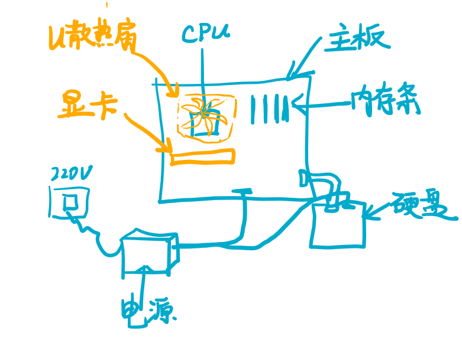

# 如何组装电脑
进入大学或者参加工作的人都会有组装一台自己电脑的打算，但是没有怎么接触过电脑组装的朋友往往觉得这件事很浪费精力，就从淘宝或者京东直接买店家组装好的机器，或者品牌一体机。

但是品牌一体机性价比太低，只是质保比较好。而店家帮忙组装的机器往往硬件上有偷工减料（二手）。所以建议自己买配件组装。
# 需要的组件
一台能启动的电脑必须的组件如下：
- 1 CPU
- 2 主板
- 3 内存
- 4 电源
- 5 磁盘
嗯没错以上四个就是最小的电脑需要的东西，而实际上我们还需要几个辅助元件：
- 1 显卡
- 2 机箱
- 3 散热风扇
如果CPU有集成显卡，这里的显卡就不需要，不过为了更好的显示性能，独立显卡还是推荐安装的。机箱则是为了美观和好看。风扇则分为CPU风扇和机箱内风扇。下图是机箱内的示意图：  
  
为了更好的性能你可以配置多块硬盘来提高存储空间，更大的内存和更好的内存频率来提高游戏性能，更好的显卡等等。
# 搭配问题
并不是所有的元件都能互相搭配的，这里最主要的搭配问题是主板和CPU以及内存的搭配，其他零件基本都是通用的。

CPU因为每一代的管脚样式和个数不同，所以需要搭配不同的主板，这里的建议是先选CPU，然后搜索这个CPU能搭配的主板。另外是内存，现在大多数内存已经是DDR4了，但是还是有些老平台用的DDR3，这俩的主板上插槽是长得不一样的，看主板的说明就知道该买3还是4了。

电源的选择上也稍微要注意，需要查一下自己的CPU和显卡加起来有多大的功耗，然后买个电源功率略高于这个功耗的即可，买更高的也是可以的，就是有点浪费。
