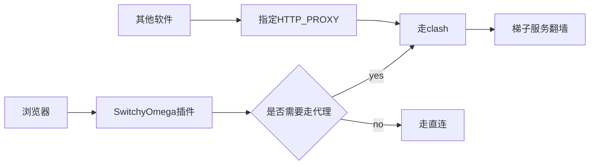

梯子也就是`vpn`，准确的讲应该是翻墙的`vpn`，是程序员必备的一项工具。因为很多常用的网站都会被屏蔽，比如`github`连接不稳定、`docker.io`全军覆没、`huggingface.co`也凉了。

那么一般是如何使用梯子的呢？

# 1 shadowsocks等协议
我个人主要使用的是基于`vmss` `vlss` `shadowsocks`等协议的机场服务，这些服务按理说是国家不允许的，但是也没有明确的法令，目前就处于灰产，机场主通过在海外机房租赁一些服务器，然后搭建机场服务。用户则通过能支持这些协议的软件客户端进行连接，比如pc端的`clash` `sing-box` `v2ray`等。

最基础的连接形式就是服务方提供ip地址 端口 还有密钥，客户端中配置一下即可。但是机场的机器是不稳定的，很多ip隔断时间就被封了，所以机场主会定期剔除那些坏掉的服务节点。因而一般是通过给用户提供一个订阅链接的形式，这个专属于个人的订阅链接，可以定期刷新服务器的列表，这样即使有些节点下线了，也可以从配置中清理。以下就是`clash`客户端中一个配置的截图


这种方式的优点在于它的运行方式，是`clash`等软件在本地启动了`socks/http`代理的服务，然后本机或者局域网内的应用可以指定代理，比如命令行可以这样设置：

```bash
$ set HTTP_PROXY=http://127.0.0.1:7890
$ set HTTPS_PROXY=http://127.0.0.1:7890
```
而浏览器也可以使用`SwitchyOmega`插件，来配置非常智能的根据域名判断是否走代理还是直连，当然了`clash`软件中也是有这项配置的。这样整体用下来非常灵活，访问百度就走直连，访问谷歌就判断走代理。这样访问国内和国外的网址都会很快。



机场服务另一个有点就是便宜，虽然梯子服务器有很多台，但是每一台都是几百上千的用户同时使用的，当然这也要归功于海外的带宽非常高，且费用很低，不像国内的服务器带宽很贵。目前我用过的机场服务，便宜点的都是100以内就能用一年，每个月有100G以上的流量。

但是机场也有他自身的问题，最大的问题就是不稳定，一有风吹草动，可能就会导致节点不稳定，被攻击，提前跑路等，你总不能报警吧，因为本来就是灰色地带。当然了因为比较便宜一个月几块钱的东西，跑路就跑路了，可以换一个。

另外一个问题是工作原理导致的，非浏览器的其他软件中，如果没有办法配置代理，那就无法连接到`clash`了。虽然很多软件都提供了`proxy`选项(下面是网易邮箱大师和vscode中的代理设置)，但还是有很多软件没有提供这个配置的，比如`docker`，另外就是这种代理方式主要来支持`http[s]`协议的，对于其他的协议只能用`socks5`，但是用法比较麻烦。可能还需要结合付费软件`proxifier` `win2socks`。


使用`win2socks`转发流量


# 2 全局VPN
`clash`等软件有无法对所有软件全局生效的问题，而全局的vpn就可以解决这个问题。全局的vpn本质上是直接虚拟一个网卡出来，这个网卡其实就是一个隧道，会把流量通过隧道转到对应的server端。并且机器上所有的网络流量，都会指向这张虚拟网卡。


全局的vpn没有那么灵活，一开就全开了，一关又全关了。但是他能对所有的app都提供代理，整个机器可以认为是翻出去了。常见的软件有`wireguard` `openvpn` 还有前阵子非常火的`warp`，`warp`集成了`wireguard`等协议，还支持配置哪些不走代理，最关键的是免费，速度还很快。也支持`clash`那种代理模式。但因为太良心了，结果被国内给封杀了。可惜了，哎。


没有`warp`的话，可以自己买海外的服务器来搭建`wireguard`或者`openvpn`，我比较推荐前者，自己用`aws`东京区域的`EC2`搭建了`wireguard`服务，本地连接后，速度还可以接受，一天中多次测试，快的时候80多M带宽，慢的时候30多M。还是可以接收的，youtube看1080p视频没问题。


具体的安装方法，我直接用了网上别人汇总好的脚本安装的，来自github仓库[hwdsl2/setup-ipsec-vpn](https://github.com/hwdsl2/setup-ipsec-vpn/blob/master/README-zh.md)，这个仓库主要是启动`ipsec-vpn`的，但是也顺带提供了`wg`和`ovpn`，wg的安装就是下面这个脚本。

```bash
$ wget -O wireguard.sh https://get.vpnsetup.net/wg
# 如果用openvpn可以把wg 改成ovpn
$ sudo bash wireguard.sh
```

安装完成把当前目录下的conf文件导入到自己电脑上即可，我是windows电脑，有图形化的`wireguard`软件（这个软件既可以做服务端，又可以做客户端），把隧道配置文件导入，连接即可。


这样在`LM studio`中也可以从`huggingface`下载模型了，虽然速度上好像远没有跑满70M（大概9M/s下载速度）带宽，但是起码也是能下载下来了，比直接网络错误没法下载强多了。


而且同时下载多个模型，每个模型都能跑到0.8+MB。


但是`wireguard`特征明显，容易被墙，更推荐openvpn。